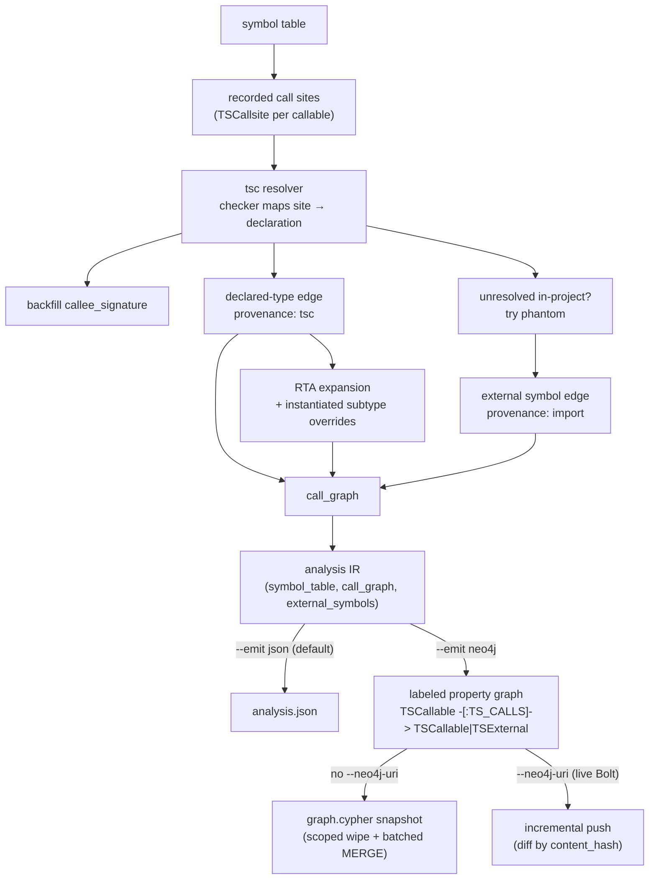
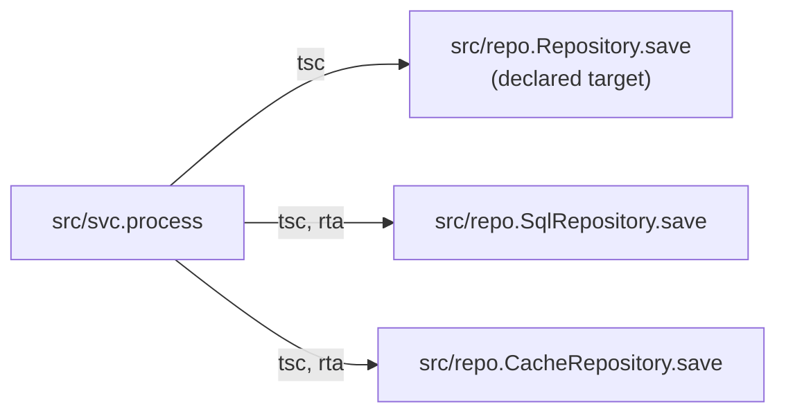

import { Aside, LinkCard, CardGrid } from "@astrojs/starlight/components";

The call graph is the answer to *"who calls whom?"* — a flat list of identity-only `TSCallEdge` objects whose `source` and `target` are signature strings. This page is the deep dive on how the **level-1** graph is built: the TypeScript checker resolves each recorded call site, Rapid Type Analysis expands virtual dispatch, and phantom nodes capture the calls that leave the project. It's the always-on base graph; [level 2](/codeanalyzer-typescript/guides/level-2/) enriches it.

The same graph has two shapes. Inside `analysis.json` it's the identity-only edge list described below. Projected into Neo4j with `--emit neo4j`, those same edges become `(:TSCallable)-[:TS_CALLS]->(:TSCallable|:TSExternal)` relationships you can traverse with Cypher — the [In the Neo4j graph](#in-the-neo4j-graph) section maps one onto the other.



## The tsc resolver

The same TypeScript type checker that typed the symbol table resolves the graph. For each `TSCallsite` recorded inside a callable, the checker maps the call expression to a callee declaration; the analyzer canonicalizes that declaration to a signature, backfills the call site's `callee_signature` in place, and emits an edge.

Because both endpoints come from the same `signatureOf` canonicalizer used to build the symbol table, **edges can only target real signatures** — there are no dangling edges. Checker-resolved edges carry `provenance: ["tsc"]`. A repeated call from the same source to the same target increments the edge's `weight` rather than duplicating it.

<Aside type="note" title="One checker, two jobs">
There's no separate call-graph pass over raw text. The compiler instance that resolved types for the symbol table is the same one that resolves call targets, so the graph reflects exactly what the project's types say — given the dependencies materialized under `node_modules`.
</Aside>

## RTA — Rapid Type Analysis

A call through an interface or a base type is a problem for naive resolution: the checker returns the *declared* target (say `Repository.save`), but at runtime the call dispatches to whichever concrete override the receiver actually has. codeanalyzer-typescript handles this with **Rapid Type Analysis**.

For a method call whose declared target lives on an interface or base type, the analyzer also emits edges to every **instantiated** concrete subtype's override of that method. "Instantiated" is the key restriction RTA adds over plain class-hierarchy analysis: a subtype's override is only added if that subtype is actually `new`'d somewhere in the program. Types that are declared but never constructed don't pollute the graph.



RTA-expanded edges are tagged so you can tell them apart from the exact declared-type edge:

```json
{
  "source": "src/svc.process",
  "target": "src/repo.SqlRepository.save",
  "type": "CALL_DEP",
  "weight": 1,
  "provenance": ["tsc"],
  "tags": { "ts.dispatch": "rta" }
}
```

A consumer that wants only exact resolution can filter out edges where `tags["ts.dispatch"] == "rta"`; one reasoning about runtime reachability keeps them.

## Phantom nodes

Not every call stays inside the project. A handler calls `express`'s `Router.get`; a utility calls `node:fs`'s `readFileSync`. Those targets aren't in the symbol table — but dropping the edge would hide real call structure. Instead, codeanalyzer-typescript attributes the call to an imported library member and emits a **phantom node**.

When the tsc resolver can't map a call site to an in-project callable, the analyzer reads the file's imports and `require`s, matches the call's binding to a module specifier, and synthesizes a `TSExternalSymbol`:

```json
{
  "signature": "node:fs.readFileSync",
  "name": "readFileSync",
  "module": "node:fs",
  "kind": "function",
  "is_external": true
}
```

The edge into it carries `provenance: ["import"]`, and the phantom is recorded in `external_symbols` under its signature — so an edge `target` byte-matches either a real `TSCallable.signature` or a `TSExternalSymbol.signature`, never nothing.

<Aside type="note" title="Only bare specifiers">
A specifier is external only if it isn't a relative or absolute path. Packages (`express`), scoped packages (`@scope/pkg`), and `node:` URLs become phantoms; relative imports (`./x`, `../lib/y`) are internal and left to the checker, never faked. Phantom resolution reads only imports — no type checker, no `node_modules` — so it works identically for TypeScript `import` and JavaScript `require`.
</Aside>

Disable phantom resolution entirely with [`--no-phantoms`](/codeanalyzer-typescript/guides/cli-usage/#phantom-nodes) if you want a graph restricted to in-project targets.

## Picking a backend: tsc, jelly, or both

The tsc resolver is the default, but it's not the only flow analyzer. Pass `--call-graph-provider tsc|jelly|both` to choose: `jelly` runs the embedded [cs-au-dk/jelly](https://github.com/cs-au-dk/jelly) flow analyzer — which ships *inside* the `cants` binary, so there's nothing extra to install — and `both` unions the two.

The provider doesn't change the *shape* of the graph: edges still go between the same signatures, and in Neo4j they're still `:TS_CALLS` relationships. What changes is `provenance` — a tsc edge carries `["tsc"]`, a jelly edge carries its own provenance tag, and an edge both agree on carries both. That makes provenance a filter you can lean on: keep only edges a given provider vouches for, or trust edges both providers found.

## Why identity-only edges

The graph stores only `source`/`target`/`weight`/`provenance`/`tags` — no embedded node objects. The nodes already exist: they're the `TSCallable` entries in the symbol table and the `TSExternalSymbol` entries in `external_symbols`. Keeping edges identity-only means the graph is a plain list of string pairs that loads into any graph library directly, and the rich per-call detail (receiver expression, argument types, location, `is_optional_chain`) lives where it belongs — on the `TSCallsite` inside the calling callable.

```python
import json, networkx as nx

app = json.load(open("analysis.json"))
g = nx.DiGraph()
for e in app["call_graph"]:
    g.add_edge(e["source"], e["target"], **{"rta": e["tags"].get("ts.dispatch") == "rta"})

# Exact-only view: drop RTA-expanded edges
exact = [(u, v) for u, v, d in g.edges(data=True) if not d["rta"]]
```

## In the Neo4j graph

`analysis.json` holds one project's call graph in memory. Project it into Neo4j with `--emit neo4j` and the same edges become a queryable, persistent system of record that composes across a whole portfolio — many applications in one database, each anchored at its own `:TSApplication` node, traversed with Cypher instead of parsed out of giant JSON blobs.

```bash
# Live, incremental push over Bolt (prefer the env var for the password)
export NEO4J_PASSWORD=secret
cants --input ./my-ts-project --emit neo4j --app-name my-ts-app \
  --neo4j-uri bolt://localhost:7687 --neo4j-user neo4j --neo4j-database neo4j
```

Omit `--neo4j-uri` and `--emit neo4j` writes a self-contained `graph.cypher` snapshot instead — constraints, indexes, a wipe scoped to this `--app-name`, then batched `MERGE`s — which you load with `cypher-shell < graph.cypher`. The live push is incremental: it diffs each module by `content_hash` and only re-pushes what changed.

The call graph maps onto two relationship types:

- **Aggregated calls** become `(:TSCallable)-[:TS_CALLS]->(:TSCallable|:TSExternal)` — the property-graph twin of `analysis.json`'s `call_graph`. The edge carries `weight` (integer), `provenance` (string array), `dispatch` (string), `external` (boolean), and `module` (string). The `tags["ts.dispatch"]` you'd read off the JSON edge is the **`dispatch` property** here, so an RTA-expanded edge is `dispatch = 'rta'`, and a phantom edge into a library lands on a `:TSExternal` node with `external = true`.
- **Per-call detail** becomes `(:TSCallable)-[:TS_HAS_CALLSITE]->(:TSCallSite)`, and each `:TSCallSite` resolves to its callee with `(:TSCallSite)-[:TS_RESOLVES_TO]->(:TSCallable|:TSExternal)`. The `:TSCallSite` node keeps the rich metadata — `method_name`, `receiver_expr`, `receiver_type`, `argument_types`, `return_type`, `callee_signature` — that lives on the `TSCallsite` in the JSON model.

So the identity-only `source → target` pair you'd traverse in `networkx` is the `:TS_CALLS` edge, and the call-site detail you'd read off the calling callable is one hop further out through `:TS_HAS_CALLSITE`.

Reachability — *"who can reach this sink?"* — that needs the whole `call_graph` in memory in JSON becomes a variable-length traversal in Cypher, scoped to one application by its `--app-name`:

```cypher
// Every callable in my-ts-app that can transitively reach a SQL sink
MATCH (app:TSApplication {name: 'my-ts-app'})-[:TS_HAS_MODULE]->(:TSModule)
      -[:TS_DECLARES*0..]->(src:TSCallable)
MATCH path = (src)-[:TS_CALLS*1..]->(sink)
WHERE sink.name = 'query' OR sink.signature CONTAINS 'mysql'
RETURN src.signature AS reaches_sink, length(path) AS hops
ORDER BY hops
LIMIT 50;
```

To see only edges a provider actually vouched for — the tsc-vs-jelly distinction from above — filter on the `provenance` array; to separate exact dispatch from RTA fan-out, filter on `dispatch`:

```cypher
// Exact (non-RTA) tsc edges out of one callable
MATCH (a:TSCallable {signature: 'src/svc.process'})-[c:TS_CALLS]->(b)
WHERE 'tsc' IN c.provenance AND c.dispatch <> 'rta'
RETURN b.signature, c.weight, c.dispatch;
```

<Aside type="note" title="Read the graph from Python — no binary, no source">
The CLDK Python SDK reads this graph back read-only over Bolt: `CLDK.typescript(backend=Neo4jConnectionConfig(uri=..., application_name="my-ts-app"))` reconstructs the **same** `networkx.DiGraph` call graph (`get_call_graph()`) and typed `TSCallable`/`TSExternal` objects the in-process analyzer produces — with no JDK, no `cants` binary, and no project source on the consumer. The `application_name` must equal the `--app-name` the graph was loaded with.
</Aside>

```python
# Read the call graph back from Neo4j — analysis produced once, read cheaply everywhere
from cldk import CLDK
from cldk.analysis.commons.backend_config import Neo4jConnectionConfig

analysis = CLDK.typescript(
    backend=Neo4jConnectionConfig(
        uri="bolt://localhost:7687",
        username="neo4j",
        password="neo4j",            # read-only credentials are sufficient
        application_name="my-ts-app",  # == the --app-name used at emit time
    ),
)
cg = analysis.get_call_graph()              # networkx.DiGraph, same as the in-process backend
externals = analysis.get_external_symbols() # phantom library targets, for source→sink reachability
```

Install the driver extra with `pip install cldk[neo4j]` (or `pip install neo4j`).

## Where to go next

<CardGrid>
  <LinkCard title="Core concepts" description="How the call graph sits alongside the symbol table and external symbols." href="/codeanalyzer-typescript/guides/concepts/" />
  <LinkCard title="Output schema" description="The TSCallEdge and TSExternalSymbol models in full." href="/codeanalyzer-typescript/reference/schema/#tscalledge" />
  <LinkCard title="Level 2: CodeQL & entrypoints" description="What enrichment will add on top of this graph." href="/codeanalyzer-typescript/guides/level-2/" />
  <LinkCard title="CLI usage" description="Flags that change the graph: --emit, --call-graph-provider, phantoms." href="/codeanalyzer-typescript/guides/cli-usage/" />
</CardGrid>
