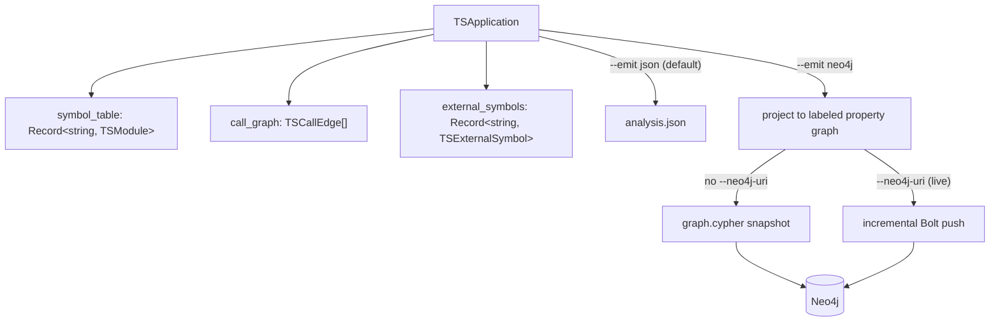
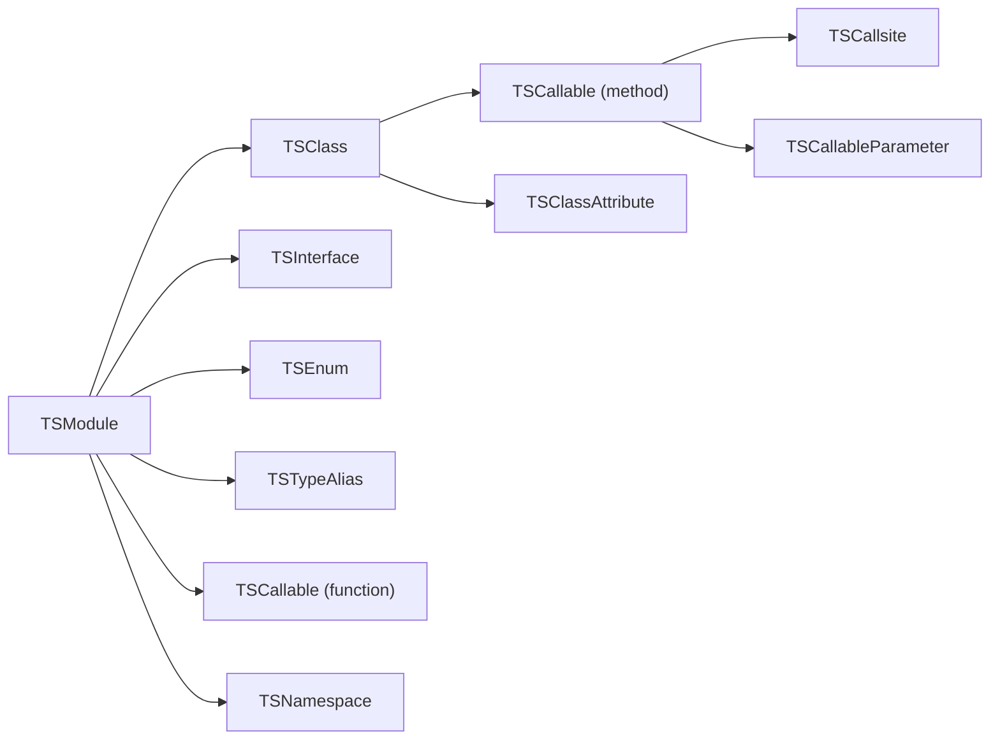
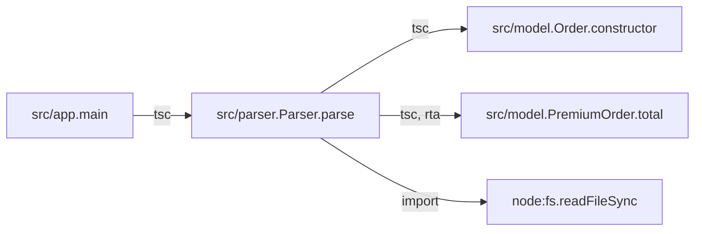
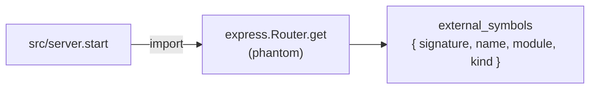
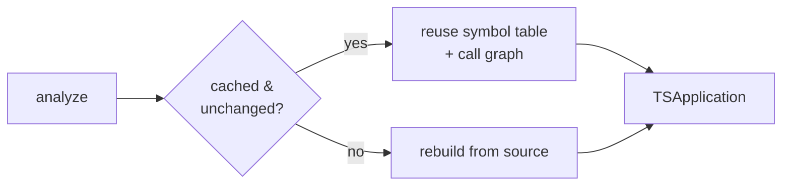

import { Aside, LinkCard, CardGrid, Tabs, TabItem } from "@astrojs/starlight/components";

Every run produces one `TSApplication` — a typed model of a project with three top-level pieces: a **symbol table**, a **call graph**, and **external symbols**. This page explains what each contains and the cross-cutting ideas you'll meet everywhere: **signatures** as identity, **provenance**, the **analysis cache**, and the **graph projection** that emits the same model as a Neo4j property graph instead of JSON.



<Aside type="note" title="Three keys, not four">
The live artifact has exactly three top-level keys: `symbol_table`, `call_graph`, and `external_symbols`. `entrypoints` is reserved in the schema but is **not emitted** by the analyzer today — see [Entrypoints](#entrypoints).
</Aside>

## Symbol table

The **symbol table** is the structured inventory of the project: one `TSModule` per source file, each holding its imports, exports, and the declarations it contains — classes, interfaces, enums, type aliases, functions, namespaces, and module-level variables. It's the foundation every other piece is built on.



A `TSCallable` (function, method, constructor, accessor, or arrow) carries its `signature`, source `code`, `parameters`, `type_parameters`, `decorators`, `call_sites`, accessed symbols, cyclomatic complexity, and TypeScript-native flags (`is_async`, `is_static`, `is_abstract`, `accessibility`, …). A `TSClass` carries its `base_classes`, `implements_types`, `methods`, `attributes`, and decorators. The TypeScript node kinds Python and Java don't have — interfaces, enums, type aliases, namespaces — are first-class. Each node records line/column spans so you can map any element back to source.

Construction is done by the **TypeScript compiler** through [ts-morph](https://ts-morph.com/): the same checker that types the project resolves references, so the analyzer materializes the project's `node_modules` first (see [Installation](/codeanalyzer-typescript/installing/)).

<Aside type="note" title="Signatures are the identity">
A callable's `signature` (e.g. `src/user.UserService.getUser`) is its identity across the whole artifact. Call-graph edges reference callables by signature, not by a separate node object — and the same signature becomes the merge key of the graph's `:TSSymbol` nodes. See [below](#signatures-are-the-identity).
</Aside>

## Call graph

The **call graph** records who-calls-whom as a flat list of `TSCallEdge` objects. Each edge is identity-only: a `source` signature, a `target` signature, a `weight`, a `provenance` list, and free-form `tags`. The nodes of the graph are the `TSCallable` entries already in the symbol table (or `external_symbols` keys for library targets) — there's no separate vertex type. Rich per-call detail (receiver, argument types, location) lives on the `TSCallsite` entries inside each callable.



The TypeScript checker resolves each recorded call site to a callee declaration and backfills `callee_signature` in place; the resulting edges are guaranteed to point at real signatures (no dangling edges). Virtual dispatch is expanded with **Rapid Type Analysis**, and calls leaving the project become phantom **external symbols**. The full mechanism is its own page — [Call graph & dispatch](/codeanalyzer-typescript/guides/call-graph/).

Because it's a plain edge list keyed by signature, loading it into a graph is direct:

```python
import json, networkx as nx

app = json.load(open("analysis.json"))
g = nx.DiGraph()
for e in app["call_graph"]:
    g.add_edge(e["source"], e["target"])

nx.has_path(g, caller_sig, sink_sig)   # reachability — a query, not a guess
```

The same `DiGraph` comes back from `analysis.get_call_graph()` when CLDK reads the **graph projection** — see [The graph projection](#the-graph-projection).

## External symbols

When a call leaves the project — into an imported library or a Node builtin — the target isn't in the symbol table. Rather than drop the edge, codeanalyzer-typescript keeps it and points it at a **phantom node**: a `TSExternalSymbol` recorded in `external_symbols`, keyed by a synthetic signature like `node:fs.readFileSync` or `express.Router.get`. This is the WALA-style phantom-node technique — it preserves cross-boundary call structure instead of silently truncating the graph at the project edge.



Only **bare** specifiers become phantoms — packages like `express`, scoped packages like `@scope/pkg`, and `node:` URLs. Relative specifiers (`./x`, `../lib/y`) are internal and are left to the checker, never faked. Phantom edges carry `provenance: ["import"]`. Phantom resolution is cheap: it reads the file's imports and `require`s, so it works identically for TypeScript (`import`) and JavaScript (`require`).

In the graph projection these become shared `:TSExternal` nodes (grouped under `:TSPackage` via `TS_MEMBER_OF`) — shared across every application in the database, since a library is the same library no matter which app imports it.

## Entrypoints

**Entrypoints** are the framework-dispatched roots of an application — the functions a framework calls that your own code never calls directly: an HTTP route handler, a message consumer, a CLI command. The schema reserves a `:TSEntrypoint` marker label (with `framework`, `detection_source`, `route_path`, and `http_methods` properties) for them.

<Aside type="caution" title="Reserved, not emitted">
`entrypoints` is **not** a top-level key of the live artifact, and the `:TSEntrypoint` marker is not yet projected — framework entrypoint detection is part of the **level-2** roadmap. See [Level 2: CodeQL & entrypoints](/codeanalyzer-typescript/guides/level-2/).
</Aside>

## Signatures are the identity

Identity is the linchpin of the whole artifact, and a **single canonicalizer** produces it on both sides of every edge — so a call graph `source`/`target` value byte-matches the corresponding `symbol_table` (or `external_symbols`) key. There's no separate node table to keep in sync.

A signature is built from two parts:

- The **file key** — the project-relative POSIX path *with* extension (e.g. `src/user.ts`) — which is the `symbol_table` key.
- The **signature prefix** — that same path *without* extension (e.g. `src/user`) — dot-joined with the member path.

So `getUser` on `UserService` in `src/user.ts` has the signature `src/user.UserService.getUser`. Constructors normalize to `<ClassSignature>.constructor` (e.g. `src/user.UserService.constructor`). Because caller- and callee-side ids come from the same function, edges always line up with the table.

This is what makes the graph projection clean. In Neo4j, signature is not just a convention — it's an enforced constraint: every signature-keyed declaration carries a `:TSSymbol` merge label with `CREATE CONSTRAINT ... REQUIRE s.signature IS UNIQUE`. A `TS_CALLS` edge and a `TS_RESOLVES_TO` edge therefore `MERGE` onto the *same* node a `TS_DECLARES` edge created, with no dangling vertices — the same guarantee the JSON edge list gives you, made structural.

## Provenance

Every `TSCallEdge` carries a `provenance` list recording how it was resolved: `"tsc"` for a checker-resolved edge, `"import"` for a phantom edge into a library, `"codeql"` once level-2 enrichment lands, or an extension's own token. It's an **open vocabulary** — a stored `analysis.json` round-trips no matter which engines produced it. Provenance lets a consumer weigh edges by confidence or filter to a single resolver's view. RTA-expanded edges additionally carry a `tags["ts.dispatch"] = "rta"` marker so you can tell an exact declared-type edge from a subtype-expansion edge.

Provenance survives the projection: the `:TS_CALLS` relationship in Neo4j carries `provenance` (string list), `dispatch` (e.g. `"rta"`), `external` (boolean), `weight` (integer), and `module` as edge properties. So the same confidence filtering is a Cypher predicate over an edge property instead of a list filter over JSON:

```cypher
MATCH (a:TSApplication {name: $app})-[:TS_HAS_MODULE]->(:TSModule)
      -[:TS_DECLARES]->(c:TSCallable)-[r:TS_CALLS]->(t)
WHERE NOT r.external AND 'tsc' IN r.provenance
RETURN c.signature, t.signature, r.weight
```

## The analysis cache

Analysis is **lazy** by default. codeanalyzer-typescript stores its results under `.codeanalyzer/` in the project (override with `--cache-dir`) and, on the next run, reuses the cached symbol table and base call graph when nothing has changed — detected by file content hash, mtime, and size. `--eager` forces a full rebuild from scratch (and reinstalls dependencies).



The same `content_hash` that drives the cache also drives **incremental graph loads**. Each `:TSModule` node stores its `content_hash`, `last_modified`, and `file_size`. When you push to a live database (`--emit neo4j --neo4j-uri …`), the Bolt writer diffs each module's `content_hash` against the copy already in the graph and only rewrites the modules that changed — re-analysis and re-load touch the same changed set. See [Incremental loads](#the-graph-projection) below.

## The graph projection

`--emit neo4j` is an **alternative output target**, not an addition: the analyzer builds exactly one `TSApplication` in memory — the same model behind `analysis.json` — and then projects it into a labeled property graph instead of serializing JSON. The projection is mechanical: signature-keyed declarations (`:TSClass`, `:TSInterface`, `:TSEnum`, `:TSTypeAlias`, `:TSNamespace`, `:TSCallable`) share a `:TSSymbol` merge label keyed on `signature`, and the detail that lived *inside* a callable in JSON — call sites, attributes, variables, decorators — becomes first-class nodes (`:TSCallSite`, `:TSAttribute`, `:TSVariable`, `:TSDecorator`) wired with explicit relationships (`TS_HAS_CALLSITE`, `TS_HAS_ATTRIBUTE`, `TS_DECLARES_VAR`, `TS_DECORATED_BY`). The flat call-graph edge list becomes `:TSCallable-[:TS_CALLS]->` edges, and each call site's resolution becomes a `TS_RESOLVES_TO` edge.

Why move off a single JSON file? An `analysis.json` has to be loaded whole into memory and doesn't compose across a portfolio — two services are two files you parse and join by hand. The graph composes: many applications live in one Neo4j database, each anchored at its own `:TSApplication` node, and whole-monorepo or cross-service reachability becomes one Cypher traversal instead of a memory problem.

### The application anchor

`--app-name` sets the `name` property of the single `:TSApplication` node every module hangs off (via `TS_HAS_MODULE`), and it is the scoping handle for everything. It defaults to the input directory's basename when omitted, and it's a `MERGE` key enforced by `CREATE CONSTRAINT app_name … REQUIRE a.name IS UNIQUE`, so re-loading the same app is idempotent and two apps never collide. The `schema_version` (currently `2.0.0`) is stamped onto this node so a consumer can detect a producer/consumer mismatch.

This anchor is what makes the database **multi-tenant**: a snapshot's prior-subgraph wipe matches only `(:TSApplication {name: <app-name>})` and detach-deletes just that app's modules and declarations — shared `:TSExternal`, `:TSPackage`, and `:TSDecorator` nodes survive, because a library is shared across every app that imports it. And it's the key the Python SDK reads back by: `application_name` in CLDK **must equal** the `--app-name` the graph was loaded with.

### Snapshot vs. live push

Which writer runs is decided by one thing — whether `--neo4j-uri` is set.

<Tabs>
  <TabItem label="Snapshot (graph.cypher)">

Without `--neo4j-uri`, the projection is rendered to a self-contained `<output>/graph.cypher` (falling back to the current directory): DDL constraints and indexes, then a scoped `DETACH DELETE` of this app's prior subgraph, then batched `UNWIND … MERGE` for nodes and relationships. It is **not** incremental by design — a static script has no view of the live database. Load it with `cypher-shell`:

```bash
cants --input ./my-ts-project --emit neo4j --app-name my-ts-app --output ./out
cypher-shell -u neo4j -p "$NEO4J_PASSWORD" < ./out/graph.cypher
```

  </TabItem>
  <TabItem label="Live Bolt push (incremental)">

With `--neo4j-uri`, the analyzer pushes over Bolt incrementally. It ensures constraints and indexes, diffs each module's `content_hash` against the database, and for each **changed** module rewrites only that module's nodes and edges; shared `:TSExternal`/`:TSPackage`/`:TSDecorator` nodes are `MERGE`-only and never deleted. Prefer the `NEO4J_PASSWORD` env var over `--neo4j-password` — a flag value is visible in shell history and the process list.

```bash
export NEO4J_PASSWORD=secret
cants --input ./my-ts-project --emit neo4j \
  --app-name my-ts-app \
  --neo4j-uri bolt://localhost:7687 \
  --neo4j-user neo4j \
  --neo4j-database neo4j
```

On a **full** run (no `--target-files`), modules whose source file vanished are pruned. A **targeted** run (`--target-files src/user.ts`) skips that pruning — it can't tell a deleted file from one you simply didn't ask about.

  </TabItem>
</Tabs>

This split is the deployment story: the analyzer runs **out of band** — a CI step or a Kubernetes Job/CronJob — pushing app-scoped subgraphs into a shared, managed or clustered Neo4j. Consumers (agents, dashboards, the CLDK SDK) are lightweight read-only clients that scale independently of the heavier analysis pods.

### Reading the graph back with CLDK

The payoff is that the Python SDK reads the graph **instead of re-analyzing**. Point `CLDK.typescript` at a `Neo4jConnectionConfig` and it reconstructs the *same* typed model objects and the *same* `networkx` call graph as the in-process analyzer — with no Node/Bun runtime, no `cants` binary, and no project source on the consumer. It needs only the Bolt URI and read-only credentials:

```python
# TypeScript project — read-only Neo4j backend
from cldk import CLDK
from cldk.analysis.commons.backend_config import Neo4jConnectionConfig

analysis = CLDK.typescript(
    backend=Neo4jConnectionConfig(
        uri="bolt://localhost:7687",
        username="neo4j",
        password="neo4j",
        application_name="my-ts-app",   # == the --app-name the graph was loaded with
    ),
)
classes = analysis.get_classes()             # Dict[str, TSClass]
externals = analysis.get_external_symbols()  # phantom library targets, for source->sink reachability
cg = analysis.get_call_graph()               # networkx.DiGraph — same as the JSON path
```

Install the driver extra with `pip install cldk[neo4j]`. Because the graph is external, `project_path` is optional for this backend, and every query is scoped by `application_name` — the same anchor name you passed to `--app-name`. The full read API and Cypher recipes are on the [Neo4j graph](/codeanalyzer-typescript/guides/neo4j/) page.

## Where to go next

<CardGrid>
  <LinkCard title="Neo4j graph" description="Emit the property graph, deploy the producer, and read it back with CLDK." href="/codeanalyzer-typescript/guides/neo4j/" />
  <LinkCard title="Call graph & dispatch" description="The tsc resolver, RTA expansion, and phantom nodes in depth." href="/codeanalyzer-typescript/guides/call-graph/" />
  <LinkCard title="Output schema" description="Every field of every model in the artifact." href="/codeanalyzer-typescript/reference/schema/" />
  <LinkCard title="CLI usage" description="The flags that control what ends up in the artifact." href="/codeanalyzer-typescript/guides/cli-usage/" />
</CardGrid>
