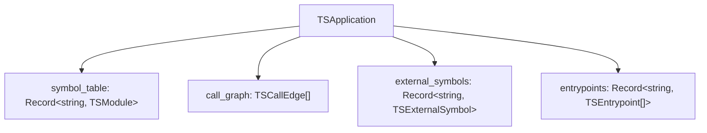
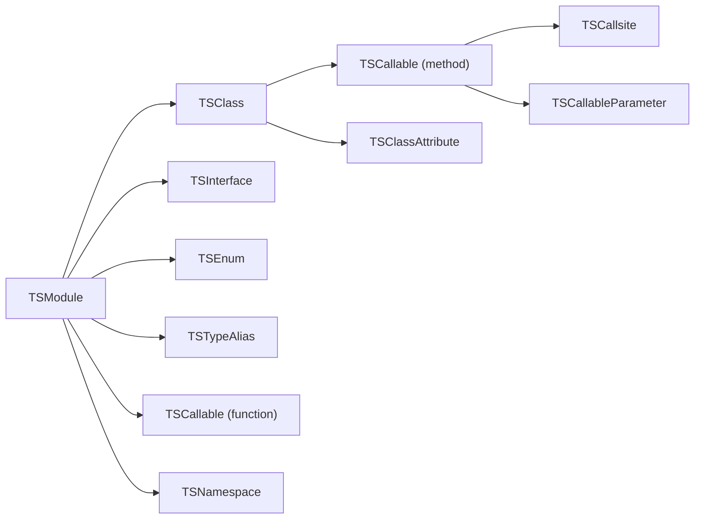
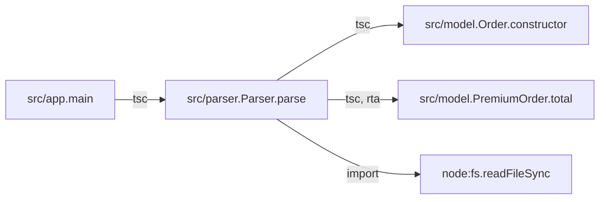
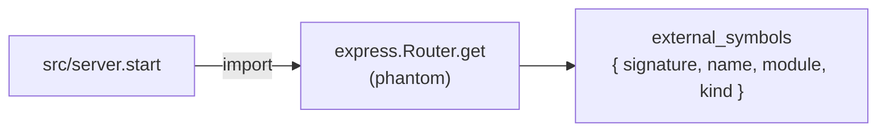
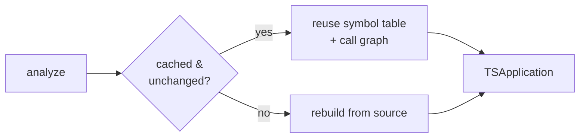

import { Aside, LinkCard, CardGrid, Tabs, TabItem } from "@astrojs/starlight/components";

Every run produces one `TSApplication` — a typed model of a project with four top-level pieces: a **symbol table**, a **call graph**, **external symbols**, and **entrypoints**. This page explains what each contains and the cross-cutting ideas you'll meet everywhere: **signatures** as identity, **provenance**, and the **analysis cache**.



## Symbol table

The **symbol table** is the structured inventory of the project: one `TSModule` per source file, each holding its imports, exports, and the declarations it contains — classes, interfaces, enums, type aliases, functions, namespaces, and module-level variables. It's the foundation every other piece is built on.



A `TSCallable` (function, method, constructor, accessor, or arrow) carries its `signature`, source `code`, `parameters`, `type_parameters`, `decorators`, `call_sites`, accessed symbols, cyclomatic complexity, and TypeScript-native flags (`is_async`, `is_static`, `is_abstract`, `accessibility`, …). A `TSClass` carries its `base_classes`, `implements_types`, `methods`, `attributes`, and decorators. The TypeScript node kinds Python and Java don't have — interfaces, enums, type aliases, namespaces — are first-class. Each node records line/column spans so you can map any element back to source.

Construction is done by the **TypeScript compiler** through [ts-morph](https://ts-morph.com/): the same checker that types the project resolves references, so the analyzer materializes the project's `node_modules` first (see [Installation](/codeanalyzer-typescript/installing/)).

<Aside type="note" title="Signatures are the identity">
A callable's `signature` (e.g. `src/user.UserService.getUser`) is its identity across the whole artifact. Call-graph edges and entrypoints both reference callables by signature, not by a separate node object — see [below](#signatures-are-the-identity).
</Aside>

## Call graph

The **call graph** records who-calls-whom as a flat list of `TSCallEdge` objects. Each edge is identity-only: a `source` signature, a `target` signature, a `weight`, a `provenance` list, and free-form `tags`. The nodes of the graph are the `TSCallable` entries already in the symbol table (or `external_symbols` keys for library targets) — there's no separate vertex type. Rich per-call detail (receiver, argument types, location) lives on the `TSCallsite` entries inside each callable.



The TypeScript checker resolves each recorded call site to a callee declaration and backfills `callee_signature` in place; the resulting edges are guaranteed to point at real signatures (no dangling edges). Virtual dispatch is expanded with **Rapid Type Analysis**, and calls leaving the project become phantom **external symbols**. The full mechanism is its own page — [Call graph & dispatch](/codeanalyzer-typescript/guides/call-graph/).

Because it's a plain edge list keyed by signature, loading it into a graph is direct:

```python
import json, networkx as nx

app = json.load(open("analysis.json"))
g = nx.DiGraph()
for e in app["call_graph"]:
    g.add_edge(e["source"], e["target"])

nx.has_path(g, caller_sig, sink_sig)   # reachability — a query, not a guess
```

## External symbols

When a call leaves the project — into an imported library or a Node builtin — the target isn't in the symbol table. Rather than drop the edge, codeanalyzer-typescript keeps it and points it at a **phantom node**: a `TSExternalSymbol` recorded in `external_symbols`, keyed by a synthetic signature like `node:fs.readFileSync` or `express.Router.get`. This is the WALA-style phantom-node technique — it preserves cross-boundary call structure instead of silently truncating the graph at the project edge.



Only **bare** specifiers become phantoms — packages like `express`, scoped packages like `@scope/pkg`, and `node:` URLs. Relative specifiers (`./x`, `../lib/y`) are internal and are left to the checker, never faked. Phantom edges carry `provenance: ["import"]`. Phantom resolution is cheap: it reads the file's imports and `require`s, so it works identically for TypeScript (`import`) and JavaScript (`require`).

## Entrypoints

**Entrypoints** are the framework-dispatched roots of an application — the functions a framework calls that your own code never calls directly: an HTTP route handler, a message consumer, a CLI command. They're collected into `entrypoints`, keyed by framework name, with each `TSEntrypoint` referencing a callable by signature and carrying framework metadata (route path, HTTP methods, …).

<Aside type="caution" title="Empty at level 1">
At level 1, `entrypoints` is always `{}`. Framework entrypoint detection is part of the **level-2** roadmap — see [Level 2: CodeQL & entrypoints](/codeanalyzer-typescript/guides/level-2/).
</Aside>

## Signatures are the identity

Identity is the linchpin of the whole artifact, and a **single canonicalizer** produces it on both sides of every edge — so a call graph `source`/`target` value byte-matches the corresponding `symbol_table` (or `external_symbols`) key. There's no separate node table to keep in sync.

A signature is built from two parts:

- The **file key** — the project-relative POSIX path *with* extension (e.g. `src/user.ts`) — which is the `symbol_table` key.
- The **signature prefix** — that same path *without* extension (e.g. `src/user`) — dot-joined with the member path.

So `getUser` on `UserService` in `src/user.ts` has the signature `src/user.UserService.getUser`. Constructors normalize to `<ClassSignature>.constructor` (e.g. `src/user.UserService.constructor`). Because caller- and callee-side ids come from the same function, edges always line up with the table.

## Provenance

Every `TSCallEdge` carries a `provenance` list recording how it was resolved: `"tsc"` for a checker-resolved edge, `"import"` for a phantom edge into a library, `"codeql"` once level-2 enrichment lands, or an extension's own token. It's an **open vocabulary** — a stored `analysis.json` round-trips no matter which engines produced it. Provenance lets a consumer weigh edges by confidence or filter to a single resolver's view. RTA-expanded edges additionally carry a `tags["ts.dispatch"] = "rta"` marker so you can tell an exact declared-type edge from a subtype-expansion edge.

## The analysis cache

Analysis is **lazy** by default. codeanalyzer-typescript stores its results under `.codeanalyzer/` in the project (override with `--cache-dir`) and, on the next run, reuses the cached symbol table and base call graph when nothing has changed — detected by file content hash, mtime, and size. `--eager` forces a full rebuild from scratch (and reinstalls dependencies).



## Where to go next

<CardGrid>
  <LinkCard title="Call graph & dispatch" description="The tsc resolver, RTA expansion, and phantom nodes in depth." href="/codeanalyzer-typescript/guides/call-graph/" />
  <LinkCard title="Output schema" description="Every field of every model in the artifact." href="/codeanalyzer-typescript/reference/schema/" />
  <LinkCard title="CLI usage" description="The flags that control what ends up in the artifact." href="/codeanalyzer-typescript/guides/cli-usage/" />
  <LinkCard title="Level 2: CodeQL & entrypoints" description="What the experimental second layer will add." href="/codeanalyzer-typescript/guides/level-2/" />
</CardGrid>
