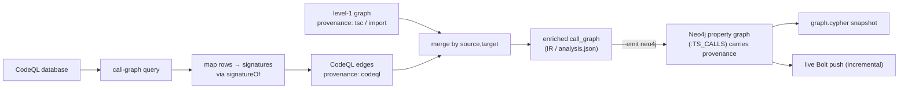

import { Aside, LinkCard, CardGrid } from "@astrojs/starlight/components";

Level 1 gives you a symbol table and a call graph resolved by the TypeScript checker, with RTA and phantom nodes. **Level 2** is the enrichment layer on top of it: CodeQL-derived edges for the dynamic cases the checker can't reach, and framework **entrypoint** detection. This page describes the design and is honest about what's implemented.

<Aside type="caution" title="Experimental — stubbed today">
Level 2 is **wired but not yet implemented**. Passing `--analysis-level 2` runs the level-1 pipeline, then logs a warning and merges in *zero* CodeQL edges; `entrypoints` stays `{}`. The flag, the merge step, and the schema fields all exist so the artifact shape is stable — the resolution work is the open part.
</Aside>

## What CodeQL enrichment will add

The TypeScript checker resolves static call structure precisely, but some edges are invisible to it — dynamic dispatch through values, reflection-like patterns, and dataflow that crosses call boundaries indirectly. CodeQL sees those. The design:

1. **Build a CodeQL database** for the project (`codeql database create --language=javascript-typescript`), cached under the analysis cache directory.
2. **Run a call-graph query** that emits caller/callee locations.
3. **Map each result row back to a signature** via the same `signatureOf` canonicalizer the rest of the analyzer uses, so CodeQL endpoints land in the same identity space as level-1 edges.
4. **Merge** the CodeQL edges into the level-1 graph, keyed by `(source, target)` — summing weights and unioning provenance, so an edge both engines saw carries `["codeql", "tsc"]`.

Only edges whose endpoints exist in the symbol table would be emitted, preserving the level-1 **no-dangling** invariant.



When you project this IR to the graph with `--emit neo4j`, the merged call edges become `:TS_CALLS` relationships and the provenance you accumulated above survives as the `provenance` property on each edge — so a CodeQL-confirmed call stays distinguishable from a checker-only call after it lands in Neo4j, whether you write a self-contained `graph.cypher` snapshot or push incrementally over Bolt. See the [Neo4j graph](/codeanalyzer-typescript/guides/neo4j/) guide for the projection itself.

### How the merge already behaves

The merge step is real and exercised today — it just receives an empty CodeQL edge list. It deduplicates by `(source, target)`: weights sum, provenance lists union (and sort), and tags merge. So once the query lands, an edge confirmed by both the checker and CodeQL will surface with both provenance tokens, and consumers can weigh edges by how many engines agreed.

<Aside type="note" title="Graceful by design">
Like dependency materialization, level-2 enrichment is meant to deepen the graph without ever gating it. If CodeQL extraction fails, the run still completes and still returns a valid level-1 artifact.
</Aside>

## Entrypoints

An **entrypoint** is a function the framework calls that your own code never calls directly — an HTTP route handler, a message consumer, a CLI command. Static call-graph analysis can't see these edges (the framework wires them at runtime), so without help those handlers look like dead code and "where does execution enter?" is unanswerable.

The schema already carries the result type, `TSEntrypoint`:

| Field | Meaning |
| --- | --- |
| `signature` | The `TSCallable.signature` this entrypoint refers to. |
| `framework` | The framework that dispatches it (e.g. `"nestjs"`, `"express"`). |
| `detection_source` | *How* it was found — `decorator`, `base_class`, `convention`, `extension`, … (open vocabulary). |
| `route_path`, `http_methods` | For HTTP routes. |
| `source_file` | The file declaring the binding. |
| `tags` | Free-form, namespaced metadata for extensions. |

The symbol table is already shaped to make detection tractable: `TSCallable` carries `is_entrypoint` and `entrypoint_framework` flags, decorators are captured with resolved qualified names and raw argument fragments (so a `@Get('/users')` route path is recoverable), and parameter decorators (`@Param('id')`) are recorded. Detection itself — the finders that populate `entrypoints[framework]` — is the level-2 work that remains.

<Aside type="note" title="The graph shape is already stable">
The Neo4j projection is ahead of the finders here. `TSEntrypoint` is a **marker label** in the property-graph schema (`schema.neo4j.json`, schema version `2.0.0`), and the projection stamps it onto entrypoint callables/classes with `framework`, `detection_source`, `route_path`, `http_methods`, and `entrypoint_count` properties. So the moment detection lands, those nodes light up without a schema change — a query like `MATCH (e:TSEntrypoint) RETURN e.route_path, e.http_methods` is valid Cypher today; it just returns nothing yet.
</Aside>

<Aside type="caution" title="Empty today">
Until finders are implemented, `app.entrypoints` is always `{}`, regardless of analysis level. Don't build on its contents yet; the field is present so the artifact shape won't change when detection arrives.
</Aside>

## Using it today

You can pass the flag — the pipeline accepts it and the artifact shape is final — but expect level-1 results:

```bash
cants --input ./my-ts-project --output ./out --analysis-level 2
# warns: CodeQL enrichment not implemented; emits no extra edges
```

That makes `--analysis-level 2` safe to wire into a pipeline now: when enrichment lands, the same command starts returning richer graphs without any schema change on your side.

## Where to go next

<CardGrid>
  <LinkCard title="Call graph & dispatch" description="The level-1 graph that level 2 enriches." href="/codeanalyzer-typescript/guides/call-graph/" />
  <LinkCard title="Neo4j graph" description="Project the call graph and entrypoints into a labeled property graph." href="/codeanalyzer-typescript/guides/neo4j/" />
  <LinkCard title="Output schema" description="The TSEntrypoint and TSCallEdge models." href="/codeanalyzer-typescript/reference/schema/#tsentrypoint" />
  <LinkCard title="Core concepts" description="Provenance and how merged edges record their engines." href="/codeanalyzer-typescript/guides/concepts/#provenance" />
</CardGrid>
