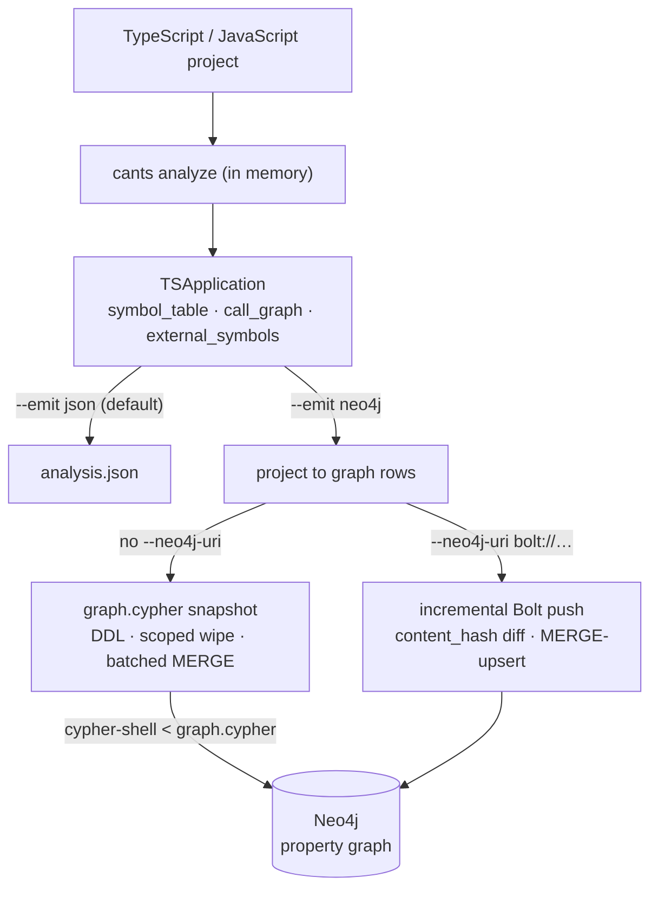
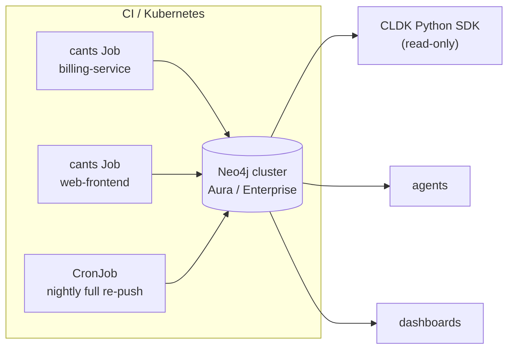

import Neo4jPropertyGraph from '../../../components/Neo4jPropertyGraph.astro';
import { Aside, LinkCard, CardGrid, Tabs, TabItem, Steps } from "@astrojs/starlight/components";

A single `analysis.json` is a fine artifact for one project, but it has a ceiling: it must be loaded whole into memory and it doesn't compose across a portfolio. `--emit neo4j` projects the *same* analysis into a **Neo4j property graph** — a persistent, queryable system of record where many applications live in one database, each anchored at its own `:TSApplication` node, and whole-monorepo or cross-service questions become a Cypher traversal instead of a parse of giant JSON blobs.

<Neo4jPropertyGraph />

This guide is the deployment story: how the two writers work, how to run the analyzer as a Kubernetes job that pushes into a shared cluster, and how lightweight read-only consumers — agents, dashboards, the [CLDK Python SDK](/codeanalyzer-typescript/guides/cli-usage/#putting-it-together) — read that graph back without ever touching the source. For the per-flag mechanics, see [CLI usage › Neo4j output](/codeanalyzer-typescript/guides/cli-usage/#neo4j-output); for the full label and relationship topology, the [graph schema reference](/codeanalyzer-typescript/reference/schema/).

## The two writers

`--emit neo4j` replaces the JSON output entirely — it is an alternative target, not additive. One analysis is built in memory and then projected to graph rows. **Which writer runs is decided by whether `--neo4j-uri` is set**, and the two are mutually exclusive.

<Tabs>
<TabItem label="Snapshot (graph.cypher)">

With **no** `--neo4j-uri`, the projection is rendered as a self-contained `graph.cypher` script and written to `<output>/graph.cypher` (or the current directory if `-o` is omitted). The script is everything needed to reconstruct this application's subgraph from nothing:

1. DDL — the constraints and indexes (so it's safe to run against an empty database).
2. A **scoped wipe** — a `DETACH DELETE` of this app's prior subgraph, matched on `(:TSApplication {name: <app-name>})`.
3. Batched `UNWIND … MERGE` for nodes and relationships (batches of 500).

```bash
cants --input ./my-ts-project --emit neo4j --app-name my-ts-app --output ./out
# -> ./out/graph.cypher

cypher-shell -u neo4j -p "$NEO4J_PASSWORD" < ./out/graph.cypher
```

A snapshot is **not incremental** by design: a static script has no view of the live database, so it always rewrites this application's subgraph from scratch. It's the right choice for a reproducible artifact you can commit, diff, or hand to a database admin to load.

</TabItem>
<TabItem label="Live push (Bolt)">

When `--neo4j-uri` is present, `cants` connects with `neo4j-driver` and pushes **incrementally** over Bolt. It ensures the constraints and indexes exist, diffs each module's `content_hash` against what's already in the database, and only touches modules that changed (batches of 1000):

```bash
export NEO4J_PASSWORD=secret
cants --input ./my-ts-project \
  --emit neo4j \
  --app-name my-ts-app \
  --neo4j-uri bolt://localhost:7687 \
  --neo4j-user neo4j \
  --neo4j-database neo4j
```

For each **changed** module, in a single write transaction, `cants` deletes that module's outgoing edges, detach-deletes the declarations it no longer emits, then MERGE-upserts its current nodes and the edges it owns. Nodes are never blindly deleted, so a declaration that another unchanged module still references survives. The driver is imported dynamically, so it stays entirely off the JSON code path.

</TabItem>
</Tabs>

<Aside type="caution" title="Prefer the password env var">
Prefer the `NEO4J_PASSWORD` environment variable over `--neo4j-password`. A value passed as a flag is visible in your shell history and in the process list. Each of the four connection settings reads an environment variable when its flag is omitted; the flag wins when both are set:

| Flag                | Environment variable | Default                          |
| ------------------- | -------------------- | -------------------------------- |
| `--neo4j-uri`       | `NEO4J_URI`          | *(none — omit ⇒ snapshot)*       |
| `--neo4j-user`      | `NEO4J_USERNAME`     | `neo4j`                          |
| `--neo4j-password`  | `NEO4J_PASSWORD`     | `neo4j`                          |
| `--neo4j-database`  | `NEO4J_DATABASE`     | *(none — driver's default DB)*   |
</Aside>



## One database, many applications

`--app-name` sets the `name` property of the single `:TSApplication` anchor node — the MERGE key for the whole graph, enforced by a uniqueness constraint. Every module hangs off that node via `TS_HAS_MODULE`, and the `schema_version` (`2.0.0`) is stamped onto it. When omitted it defaults to the input directory's basename, but in a shared database you should always set it explicitly and keep it **stable**: it is the scoping handle the CLDK SDK reads the graph back by.

It is also the multi-tenant boundary. The scoped wipe matches `(:TSApplication {name: <app-name>})` and detach-deletes **only that application's** modules and declarations, so loading `billing-service` never clobbers `web-frontend` in the same database. The genuinely shared nodes — `:TSExternal` library symbols, `:TSPackage` nodes, and `:TSDecorator` definitions — carry no `_module` property; they are MERGE-only and survive across every application, so a package imported by ten apps is stored once.

```cypher
// Every external package any application in the database imports
MATCH (a:TSApplication)-[:TS_HAS_MODULE]->(:TSModule)-[:TS_IMPORTS]->(p:TSPackage)
RETURN a.name AS application, collect(DISTINCT p.name) AS packages
ORDER BY application
```

That query is the whole point of the graph: with each `analysis.json` you'd open and parse N files; here cross-portfolio analysis is one traversal.

## Deploying the producer/consumer split

The architecture that scales splits cleanly into a **producer** and **consumers**.

- The **producer** is `cants --emit neo4j --neo4j-uri …`. It is the heavy half — it materializes `node_modules`, type-checks, and builds the call graph — so run it out-of-band, on its own schedule, against a managed or clustered Neo4j (Aura, Neo4j Enterprise, or a self-hosted cluster).
- The **consumers** — agents, the CLDK SDK, dashboards — are lightweight, read-only Bolt clients. They never analyze anything; they query a database that's already populated, so they scale independently of the analysis pods and need only read-only credentials.

Many producer jobs write app-scoped subgraphs into one shared cluster; reads fan out from it.



### As a Kubernetes Job

A per-application analysis is a natural fit for a `Job` (one-shot, on a push) or a `CronJob` (a scheduled refresh). The producer needs the project source mounted, the `cants` binary (self-contained — no Bun or Node at runtime), and the Bolt credentials from a `Secret`:

```yaml
apiVersion: batch/v1
kind: Job
metadata:
  name: analyze-billing-service
spec:
  template:
    spec:
      restartPolicy: Never
      containers:
        - name: cants
          image: ghcr.io/your-org/cants:latest
          args:
            - --input=/src
            - --emit=neo4j
            - --app-name=billing-service
            - --neo4j-uri=bolt://neo4j.data.svc:7687
            - --neo4j-database=neo4j
            - --eager
          env:
            - name: NEO4J_USERNAME
              valueFrom: { secretKeyRef: { name: neo4j-writer, key: username } }
            - name: NEO4J_PASSWORD
              valueFrom: { secretKeyRef: { name: neo4j-writer, key: password } }
          volumeMounts:
            - { name: src, mountPath: /src, readOnly: true }
      volumes:
        - name: src
          # e.g. a checkout from an initContainer, or a PVC
          emptyDir: {}
```

Because `NEO4J_PASSWORD` and `NEO4J_USERNAME` are read from the environment, the secret never appears in the pod's command line. Give the producer a **read/write** role scoped to the application's labels; give every consumer a **read-only** role. That RBAC split is what makes the graph governed infrastructure rather than a shared mutable blob.

### Incremental loads in CI

On the Bolt path, `--target-files` (`-t`) flips the run from **full** to **targeted** — push only the modules a commit touched, served from cache for the rest:

```bash
export NEO4J_PASSWORD=secret
cants --input ./my-ts-project \
  --emit neo4j \
  --app-name billing-service \
  --neo4j-uri bolt://neo4j.data.svc:7687 \
  --target-files src/billing.ts src/invoice.ts
```

<Aside type="note" title="Full run vs targeted run">
A **full** run (no `--target-files`) also prunes orphans: modules whose source file vanished are detach-deleted along with their descendants. A **targeted** run skips that pruning, because it can't tell a deleted file apart from one you simply didn't target this time. The common pattern is a fast targeted push per commit and a periodic full re-push — a `CronJob` — that reconciles deletions.
</Aside>

## Why this is enterprise-grade

The graph is meant to be **governed infrastructure your tools can depend on**, not a one-off export:

- **Multi-tenant by construction.** The `--app-name` anchor plus the per-application scoped wipe mean apps never clobber each other in a shared database.
- **Incremental.** Content-hash diffing (alongside `last_modified` and `file_size`) means a re-load only touches changed modules — cheap enough to run on every commit.
- **A versioned schema contract.** `schema_version` (`2.0.0`) is stamped on every `:TSApplication` node, and `--emit schema` publishes the machine-readable contract (`schema.json`) so a consumer can detect a producer/consumer version mismatch *before* it queries. The contract is bundled in every release and enforced by a conformance test, so the emitter can't drift from it.
- **Read-only credentials and RBAC.** Consumers never need write access; the producer's writer role and the consumers' reader role are separate Neo4j roles.
- **HA and clustering.** Point the producer and consumers at Neo4j Aura or an Enterprise cluster; the Bolt URI is the only thing that changes.
- **Code search built in.** The projection creates a fulltext index, `code_fts`, over `TSCallable.code` and its docstring, plus name indexes on callables and decorators — so searching every callable in the portfolio is one Cypher call:

```cypher
CALL db.index.fulltext.queryNodes('code_fts', 'createConnection') YIELD node, score
MATCH (a:TSApplication)-[:TS_HAS_MODULE]->(:TSModule)-[:TS_DECLARES]->(node)
RETURN a.name AS application, node.signature AS callable, score
ORDER BY score DESC LIMIT 25
```

## Reading the graph back with CLDK

The payoff of producing analysis once, centrally, is that consumers read it **cheaply, everywhere**. CLDK ships a read-only Neo4j backend: point `CLDK.typescript(backend=Neo4jConnectionConfig(...))` at the Bolt URI and it reconstructs the **same typed model objects and the same `networkx` call graph** as the in-process analyzer — with **no JDK, no native binary, and no project source** on the consumer. It only needs the graph and read-only credentials.

<Steps>

1. Install the driver extra:

   ```bash
   pip install "cldk[neo4j]"   # or: pip install neo4j
   ```

2. Construct the facade against the Bolt URI. The `application_name` **must equal** the `--app-name` the graph was loaded with — it's how every query is scoped to one application:

   ```python
   from cldk import CLDK
   from cldk.analysis.commons.backend_config import Neo4jConnectionConfig

   analysis = CLDK.typescript(
       backend=Neo4jConnectionConfig(
           uri="bolt://localhost:7687",
           username="neo4j",
           password="neo4j",              # read-only credentials suffice
           database=None,                 # None => server default DB
           application_name="my-ts-app",  # == the --app-name the graph was loaded with
       ),
   )
   ```

3. Read the model. The `get_*` methods return the identical typed objects the in-process backend produces:

   ```python
   classes   = analysis.get_classes()           # Dict[str, TSClass]
   externals = analysis.get_external_symbols()  # phantom library targets, for source->sink reachability
   cg        = analysis.get_call_graph()         # networkx.DiGraph
   ```

</Steps>

The backend bulk-fetches nodes and relationships in a handful of Cypher queries and rebuilds the same `TSApplication` (a `TSModule` symbol table, the call edges, and external symbols) the analyzer would have produced in process. The full read surface — `get_symbol_table()`, `get_call_graph()`, `get_classes()`, `get_interfaces()`, `get_functions()`, `get_external_symbols()`, `get_callers()`, `get_callees()`, `get_class_hierarchy()`, `get_decorators()` — is available on the Neo4j-backed facade.

<Aside type="note" title="Out-of-band by design">
The Neo4j backend is a pure, read-only Cypher client. It never builds or writes the graph and has no dependency on the `cants` engine, a JDK or binary, or the project sources — the graph is populated out of band by the producer job. Because the graph is external, `project_path` is **optional**: the facade falls back to it only to resolve `application_name` if you didn't pass one. Backends are context managers (`with`) and `.close()` releases the driver. Parity with the in-memory backend holds modulo a few projection-lossy fields (comments collapse to a docstring; some edges to library targets may be absent).
</Aside>

## Where to go next

<CardGrid>
  <LinkCard title="CLI usage" description="Per-flag mechanics: --emit, --app-name, the connection flags, incremental loads." href="/codeanalyzer-typescript/guides/cli-usage/#neo4j-output" />
  <LinkCard title="Neo4j graph schema" description="Every node label, relationship type, and the versioned schema contract." href="/codeanalyzer-typescript/reference/schema/" />
  <LinkCard title="CLI reference" description="The complete flag table with defaults and environment variables." href="/codeanalyzer-typescript/reference/cli/" />
  <LinkCard title="Call graph & dispatch" description="How the call graph that lands in the property graph is built." href="/codeanalyzer-typescript/guides/call-graph/" />
</CardGrid>
