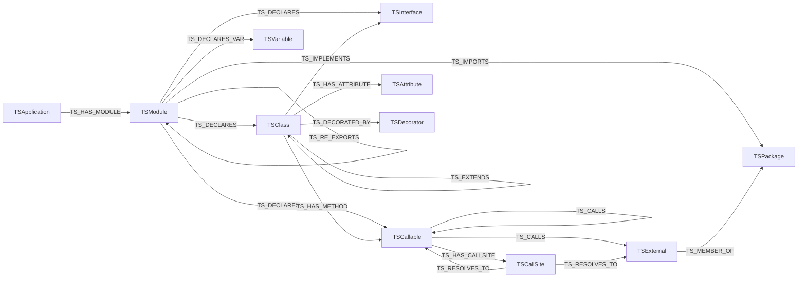

import Neo4jPropertyGraph from '../../../components/Neo4jPropertyGraph.astro';
import { Aside, LinkCard, CardGrid, Tabs, TabItem } from "@astrojs/starlight/components";

`cants --emit neo4j` projects the same in-memory `TSApplication` that backs `analysis.json` into a **labeled property graph**. Instead of one JSON file you load whole into memory, the analysis lands in Neo4j as nodes and typed relationships you query with Cypher. Many applications share one database — each anchored at its own `:TSApplication` node — so whole-monorepo and cross-service questions become a graph traversal rather than a parsing problem.

This page is the authoritative description of that graph: every node label and its MERGE key, every relationship type and its properties, the constraints and indexes the projection writes, and the versioned schema contract a consumer uses to check it speaks the same dialect.

<Neo4jPropertyGraph />

The labels and relationships below come from `src/build/neo4j/catalog.ts` (`NODE_LABELS`, `REL_TYPES`, `MARKER_LABELS`, `SCHEMA_VERSION`); the DDL from `src/build/neo4j/schema.ts`; and the projection that emits them from `src/build/neo4j/project.ts`. The same definitions are published as a machine-readable `schema.neo4j.json` (see [Schema contract](#schema-contract)).

<Aside type="caution" title="This is the graph schema, not the JSON schema">
The node labels here (`:TSCallSite`, `:TSAttribute`, `:TSVariable`, …) are the *graph* model. They do not map one-to-one to the `analysis.json` model classes (`TSCallsite`, `TSClassAttribute`, `TSVariableDeclaration`, …) documented in the [Output schema](/codeanalyzer-typescript/reference/schema/). The graph is a projection of that model, not a re-serialization of it.
</Aside>

## Topology

Every analyzed module hangs off a single application anchor; declarations, members, call sites, and the aggregated call graph hang off the modules. Externals, packages, and decorators are **shared** across applications — they carry no `_module` property and are never deleted by a re-load.



## Node labels

Each label below lists its **MERGE key** — the property the projection matches on to upsert the node — and the properties it carries. The `_module` property (present on `:TSModule` and `:TSNamespace`) records the owning module so incremental re-loads can scope a per-module delete; shared nodes omit it.

| Label | MERGE key | Properties |
| --- | --- | --- |
| `:TSApplication` | `name` | `name`, `schema_version` |
| `:TSModule` | `file_key` | `file_key`, `module_name`, `is_tsx`, `is_declaration_file`, `content_hash`, `last_modified`, `file_size`, `_module` |
| `:TSClass` | `signature` | `signature`, `name`, `code`, `base_classes`, `implements_types`, `type_parameter_names`, `docstring`, `is_abstract` |
| `:TSInterface` | `signature` | `signature`, `name`, `code`, `base_classes`, `type_parameter_names`, `call_signatures`, `index_signatures`, `docstring` |
| `:TSEnum` | `signature` | `signature`, `name`, `code`, `member_names`, `member_values`, `docstring`, `is_const`, `is_exported` |
| `:TSTypeAlias` | `signature` | `signature`, `name`, `code`, `aliased_type`, `type_parameter_names`, `docstring`, `is_exported`, `is_ambient` |
| `:TSNamespace` | `signature` | `signature`, `name`, `docstring`, `is_exported`, `is_ambient`, `start_line`, `end_line`, `_module` |
| `:TSCallable` | `signature` | `signature`, `name`, `path`, `kind`, `return_type`, `cyclomatic_complexity`, `code`, `code_start_line` |
| `:TSExternal` | `signature` | `signature`, `name`, `module` |
| `:TSPackage` | `name` | `name` |
| `:TSDecorator` | `qualified_name` | `qualified_name`, `name` |
| `:TSCallSite` | `id` | `id`, `method_name`, `receiver_expr`, `receiver_type`, `argument_types`, `type_arguments`, `return_type`, `callee_signature` |
| `:TSAttribute` | `id` | `id`, `name`, `type`, `initializer`, `accessibility`, `docstring`, `is_static`, `is_readonly` |
| `:TSVariable` | `id` | `id`, `name`, `type`, `initializer`, `scope`, `declaration_kind`, `is_readonly`, `is_exported` |

### Merge and marker labels

- **`:TSSymbol`** — keyed on `signature`. A shared merge label carried alongside the structural label, so a `app_name`-independent constraint can enforce one node per signature. Used by the DDL constraint `symbol_sig`.
- **`:TSEntrypoint`** — a marker label projected *onto* an entrypoint callable or class (it adds `framework`, `detection_source`, `route_path`, `http_methods`, `entrypoint_count`), rather than a node type of its own. Entrypoint detection is a [level-2 roadmap](/codeanalyzer-typescript/guides/level-2/) feature, so this marker is reserved and unpopulated at level 1.

## Relationship types

| Relationship | Endpoints | Properties |
| --- | --- | --- |
| `TS_HAS_MODULE` | `(:TSApplication)→(:TSModule)` | — |
| `TS_DECLARES` | `(:TSModule\|TSNamespace\|TSClass\|TSCallable)→(:TSClass\|TSInterface\|TSEnum\|TSTypeAlias\|TSNamespace\|TSCallable)` | — |
| `TS_HAS_METHOD` | `(:TSClass\|TSInterface)→(:TSCallable)` | — |
| `TS_HAS_ATTRIBUTE` | `(:TSClass\|TSInterface)→(:TSAttribute)` | — |
| `TS_DECLARES_VAR` | `(:TSModule\|TSNamespace\|TSCallable)→(:TSVariable)` | — |
| `TS_HAS_CALLSITE` | `(:TSCallable)→(:TSCallSite)` | — |
| `TS_RESOLVES_TO` | `(:TSCallSite)→(:TSCallable\|TSExternal)` | — |
| `TS_CALLS` | `(:TSCallable)→(:TSCallable\|TSExternal)` | `weight` (int), `provenance` (string[]), `dispatch` (string, e.g. `rta`), `external` (bool), `module` (string) |
| `TS_EXTENDS` | `(:TSClass\|TSInterface)→(:TSClass\|TSInterface)` | — |
| `TS_IMPLEMENTS` | `(:TSClass)→(:TSInterface)` | — |
| `TS_IMPORTS` | `(:TSModule)→(:TSModule\|TSPackage)` | `imported_names` (string[]), `import_kinds` (string[]), `is_type_only` (bool) |
| `TS_RE_EXPORTS` | `(:TSModule)→(:TSModule\|TSPackage)` | — |
| `TS_MEMBER_OF` | `(:TSExternal)→(:TSPackage)` | — |
| `TS_DECORATED_BY` | `(:TSClass\|TSCallable\|TSAttribute)→(:TSDecorator)` | `positional_arguments` (string[]), `keyword_arguments_json` (string), `start_line` (int), `end_line` (int) |

`TS_CALLS` is the graph twin of `analysis.json`'s `call_graph`: an aggregated, deduplicated call-graph edge. `TS_HAS_CALLSITE` + `TS_RESOLVES_TO` keep the rich per-call metadata behind each edge, so you can drill from the summarized edge down to the exact invocation. Integer-valued properties are stored as `neo4j.int` so the snapshot and the Bolt push agree on types.

## Constraints and indexes

The projection runs its DDL before any data is written (the snapshot embeds it; the Bolt writer ensures it on connect). The uniqueness constraints double as the MERGE keys above.

```cypher
-- Uniqueness constraints (also the MERGE keys)
CREATE CONSTRAINT symbol_sig    IF NOT EXISTS FOR (n:TSSymbol)      REQUIRE n.signature      IS UNIQUE;
CREATE CONSTRAINT app_name      IF NOT EXISTS FOR (a:TSApplication) REQUIRE a.name           IS UNIQUE;
CREATE CONSTRAINT module_key    IF NOT EXISTS FOR (m:TSModule)      REQUIRE m.file_key        IS UNIQUE;
CREATE CONSTRAINT package_name  IF NOT EXISTS FOR (p:TSPackage)     REQUIRE p.name           IS UNIQUE;
CREATE CONSTRAINT decorator_qn  IF NOT EXISTS FOR (d:TSDecorator)   REQUIRE d.qualified_name IS UNIQUE;
CREATE CONSTRAINT callsite_id   IF NOT EXISTS FOR (c:TSCallSite)    REQUIRE c.id             IS UNIQUE;
CREATE CONSTRAINT attribute_id  IF NOT EXISTS FOR (a:TSAttribute)   REQUIRE a.id             IS UNIQUE;
CREATE CONSTRAINT variable_id   IF NOT EXISTS FOR (v:TSVariable)    REQUIRE v.id             IS UNIQUE;

-- Lookup indexes
CREATE INDEX callable_name  IF NOT EXISTS FOR (c:TSCallable)  ON (c.name);
CREATE INDEX decorator_name IF NOT EXISTS FOR (d:TSDecorator) ON (d.name);

-- Fulltext index for code search over the graph
CREATE FULLTEXT INDEX code_fts IF NOT EXISTS FOR (c:TSCallable) ON EACH [c.code, c.docstring];
```

The `app_name` constraint is what makes the graph **multi-tenant**: one node per application name, so two analyzer jobs writing different apps into the same cluster can never collide. `code_fts` indexes each callable's body and docstring, turning the graph into a searchable code index:

```cypher
CALL db.index.fulltext.queryNodes('code_fts', 'createConnection')
YIELD node, score
RETURN node.signature, score
ORDER BY score DESC
LIMIT 10;
```

## Scoping and the shared core

Everything is scoped to one application through the `:TSApplication` anchor whose `name` is set by `--app-name` (and defaults to the input directory's basename). Module nodes attach to it via `TS_HAS_MODULE`; declarations and members descend from there. When you re-emit an application:

- The **snapshot** (`graph.cypher`) opens with a scoped `DETACH DELETE` of the prior subgraph matching `(:TSApplication {name: <app-name>})`, then re-creates it. Only that application's modules and declarations are wiped.
- The **Bolt push** diffs each module's `content_hash` against the live database and rewrites only the modules that changed.

In both paths, `:TSExternal`, `:TSPackage`, and `:TSDecorator` nodes are **shared** — they have no `_module` property, are MERGE-only, and are never deleted. A library symbol or a decorator referenced by many applications lives once and survives every re-load. See the [Neo4j guide](/codeanalyzer-typescript/guides/cli-usage/) for the producer side of this — the snapshot-vs-Bolt choice and the incremental diff.

## Schema contract

The graph schema is **versioned**. `schema_version` is `2.0.0`, and it is stamped onto the `:TSApplication` node when the graph is loaded — so a consumer can read it back and detect a producer/consumer mismatch before trusting the data.

You can publish the machine-readable contract without analyzing anything:

```bash
# Print the schema contract to stdout
cants --emit schema

# Or write it to a directory as schema.json
cants --emit schema --output ./out
```

`--emit schema` serializes the in-repo catalog (`src/build/neo4j/catalog.ts`) to `schema.json` — the same definitions this page describes — listing the node labels, relationship types, their keys and properties, and `schema_version`. It needs no `--input`. A conformance test (`test/neo4j-schema.test.ts`) asserts the catalog and the emitter agree, so the contract cannot silently drift from what the projection actually writes.

The contract is bundled in every release as both a wheel asset and a GitHub Release asset. The Python package exposes `codeanalyzer_typescript.schema_path()` so a consumer can locate the bundled `schema.json` without re-downloading it.

<Tabs>
<TabItem label="Validate from a release">

```bash
# Fetch the published contract and compare versions
cants --emit schema --output ./out
jq '.schema_version' ./out/schema.json     # "2.0.0"
```

</TabItem>
<TabItem label="Check a loaded graph">

```cypher
MATCH (a:TSApplication {name: 'my-app'})
RETURN a.name, a.schema_version;
```

</TabItem>
</Tabs>

## Querying the graph

Once loaded, the graph answers questions Cypher-first. A few worked examples against one application:

```cypher
-- Callees of a given function, with how the edge resolved
MATCH (caller:TSCallable {name: 'handleRequest'})-[r:TS_CALLS]->(callee)
RETURN callee.signature, r.weight, r.dispatch, r.external;

-- Reach into a library: which in-project callables hit an external package
MATCH (c:TSCallable)-[:TS_CALLS]->(e:TSExternal)-[:TS_MEMBER_OF]->(p:TSPackage)
WHERE p.name = 'express'
RETURN c.signature, e.name;

-- Class hierarchy for one application
MATCH (app:TSApplication {name: 'my-app'})-[:TS_HAS_MODULE]->(:TSModule)
      -[:TS_DECLARES]->(sub:TSClass)-[:TS_EXTENDS]->(sup:TSClass)
RETURN sub.name AS subclass, sup.name AS superclass;

-- Cross-application reach: any app whose code calls a given package
MATCH (app:TSApplication)-[:TS_HAS_MODULE]->(:TSModule)-[:TS_DECLARES]->(:TSCallable)
      -[:TS_CALLS]->(:TSExternal)-[:TS_MEMBER_OF]->(:TSPackage {name: 'lodash'})
RETURN DISTINCT app.name;
```

The last query is the point of the graph: it crosses *every* application in the database in a single traversal — something no single `analysis.json` can answer, because each one only knows its own project.

## Reading it from CLDK

You rarely need to write Cypher by hand. The [CLDK](https://github.com/codellm-devkit/python-sdk) Python SDK has a read-only Neo4j backend that reconstructs the **same typed model objects and the same `networkx` call graph** the in-process analyzer produces — with no JDK, no `cants` binary, and no project source on the consumer. It only needs the Bolt URI and read-only credentials. Pass the same `application_name` the graph was loaded with under `--app-name`:

```python
from cldk import CLDK
from cldk.analysis.commons.backend_config import Neo4jConnectionConfig

analysis = CLDK.typescript(
    backend=Neo4jConnectionConfig(
        uri="bolt://localhost:7687",
        username="neo4j",
        password="neo4j",          # prefer reading this from the environment
        application_name="my-app",  # MUST equal the --app-name the graph was loaded with
    ),
)

classes = analysis.get_classes()              # Dict[str, TSClass]
externals = analysis.get_external_symbols()   # phantom library targets, for reachability
cg = analysis.get_call_graph()                # networkx.DiGraph
```

Install the driver extra with `pip install cldk[neo4j]` (or `pip install neo4j`). The backend is selected by the *type* of the `backend=` config — a `Neo4jConnectionConfig` swaps the facade onto the Neo4j backend; the default config uses the in-process analyzer. Because the graph is external, `project_path` is optional for this backend. See [Reading from CLDK](/codeanalyzer-typescript/guides/cli-usage/) for the full SDK surface (`get_call_graph`, `get_class_hierarchy`, `get_callers`/`get_callees`, `get_decorators`, …).

## Where to go next

<CardGrid>
  <LinkCard title="CLI options" description="--emit neo4j, --app-name, and the Bolt connection flags." href="/codeanalyzer-typescript/reference/cli/" />
  <LinkCard title="Output schema" description="The TSApplication model the graph is projected from." href="/codeanalyzer-typescript/reference/schema/" />
  <LinkCard title="Call graph & dispatch" description="How TS_CALLS edges and external symbols are resolved." href="/codeanalyzer-typescript/guides/call-graph/" />
</CardGrid>
