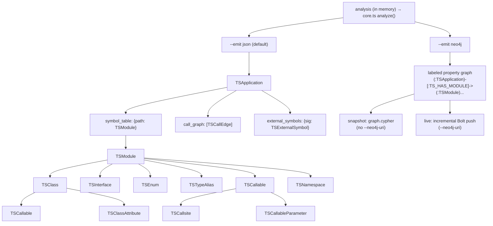

import { Aside, LinkCard, CardGrid } from "@astrojs/starlight/components";

The artifact `cants` emits is a single `TSApplication`. Every model below is a TypeScript interface defined in `src/schema/schema.ts`; the `analysis.json` output is a serialization of that schema. All field names are `snake_case` so the keys match the CLDK SDK's models. Line/column fields default to `-1` when unknown.

This page documents the **IR** — the in-memory model and its `analysis.json` serialization (`--emit json`, the default). The same analysis can instead be projected into a **Neo4j property graph** (`--emit neo4j`). That projection is a *different* namespace: a graph of labeled nodes and typed relationships, not nested records. The IR's `TSCallEdge`/`TSExternalSymbol`/`TSImport` become `:TS_CALLS`/`:TSExternal`/`:TS_IMPORTS` in the graph, and the analyzer renames on projection — see the [Neo4j graph schema](/codeanalyzer-typescript/reference/neo4j-schema/) for the label-and-relationship contract. The IR is fully reconstructable from the graph: the CLDK Python SDK reads the graph back into the very same model objects below.



The right branch is documented on its own page; everything below is the `analysis.json` IR.

## TSApplication

The root object. The emitted artifact has **three** top-level keys; `entrypoints` is reserved by the schema but not emitted at level 1.

| Field | Type | Description |
| --- | --- | --- |
| `symbol_table` | `Record<string, TSModule>` | File path → module model. The whole-project inventory. |
| `call_graph` | `TSCallEdge[]` | Identity-keyed call edges. |
| `external_symbols` | `Record<string, TSExternalSymbol>` | Phantom stubs for call targets outside the project. |

<Aside type="note">
`entrypoints` (framework name → detected roots) is part of the schema and the graph's `:TSEntrypoint` marker label, but `core.ts` does not emit it yet — entrypoint detection is level-2 roadmap. Don't depend on a fourth top-level key in `analysis.json`.
</Aside>

## TSModule

One per source file.

| Field | Type | Description |
| --- | --- | --- |
| `file_path` | `string` | Path to the file. |
| `module_name` | `string` | The file key minus extension (== signature prefix). |
| `imports` | `TSImport[]` | Import statements. |
| `exports` | `TSExport[]` | Export statements and re-exports. |
| `comments` | `TSComment[]` | Comments and JSDoc. |
| `classes` | `Record<string, TSClass>` | Top-level classes by name. |
| `interfaces` | `Record<string, TSInterface>` | Top-level interfaces by name. |
| `enums` | `Record<string, TSEnum>` | Top-level enums by name. |
| `type_aliases` | `Record<string, TSTypeAlias>` | Top-level type aliases by name. |
| `functions` | `Record<string, TSCallable>` | Top-level functions by name. |
| `namespaces` | `Record<string, TSNamespace>` | Top-level namespaces by name. |
| `variables` | `TSVariableDeclaration[]` | Module-level variables. |
| `is_tsx` | `boolean` | Whether the file is `.tsx`/`.jsx`. |
| `is_declaration_file` | `boolean` | Whether it's a `.d.ts` file. |
| `content_hash`, `last_modified`, `file_size` | `string` / `number` / `number` | Cache-invalidation metadata (nullable). The graph diffs `content_hash` per module to push only what changed on an incremental Bolt load. |

## TSClass

| Field | Type | Description |
| --- | --- | --- |
| `name` | `string` | Class short name. |
| `signature` | `string` | Fully-qualified identity (e.g. `src/user.UserService`). |
| `base_classes` | `string[]` | Spine: union of `extends` + `implements` as signature strings. |
| `implements_types` | `string[]` | Typed split: just the implemented interfaces. |
| `type_parameters` | `TSTypeParameter[]` | Generic parameters. |
| `decorators` | `TSDecorator[]` | Class decorators. |
| `methods` | `Record<string, TSCallable>` | Methods by name. |
| `attributes` | `Record<string, TSClassAttribute>` | Class attributes by name. |
| `inner_classes` | `Record<string, TSClass>` | Nested classes. |
| `is_abstract`, `is_exported`, `is_ambient` | `boolean` | Class modifiers (`abstract`, `export`, `declare`). |
| `comments`, `code` | `TSComment[]` / `string` | JSDoc/comments and source. |
| `start_line`, `end_line` | `number` | Source span. |

## TSInterface

A TypeScript node kind with no analog in the Python/Java schema.

| Field | Type | Description |
| --- | --- | --- |
| `name`, `signature` | `string` | Short name and fully-qualified identity. |
| `base_classes` | `string[]` | Extended interfaces (signature strings). |
| `type_parameters` | `TSTypeParameter[]` | Generic parameters. |
| `methods` | `Record<string, TSCallable>` | Method members (bodiless). |
| `properties` | `Record<string, TSClassAttribute>` | Property members. |
| `call_signatures` | `string[]` | Raw text of call/construct signatures. |
| `index_signatures` | `string[]` | Raw text of `[key: string]: T`. |
| `is_exported`, `is_ambient` | `boolean` | Modifiers. |
| `comments`, `code`, `start_line`, `end_line` | | JSDoc, source, span. |

## TSEnum

| Field | Type | Description |
| --- | --- | --- |
| `name`, `signature` | `string` | Short name and identity. |
| `members` | `TSEnumMember[]` | Each member's `name` and `value` (initializer text or computed const value). |
| `is_const` | `boolean` | `const enum`. |
| `is_exported`, `is_ambient` | `boolean` | Modifiers. |
| `comments`, `code`, `start_line`, `end_line` | | JSDoc, source, span. |

## TSTypeAlias

| Field | Type | Description |
| --- | --- | --- |
| `name`, `signature` | `string` | Short name and identity. |
| `aliased_type` | `string` | The right-hand-side type text. |
| `type_parameters` | `TSTypeParameter[]` | Generic parameters. |
| `is_exported`, `is_ambient` | `boolean` | Modifiers. |
| `comments`, `code`, `start_line`, `end_line` | | JSDoc, source, span. |

## TSNamespace

A recursive container with the same declaration buckets as a module.

| Field | Type | Description |
| --- | --- | --- |
| `name`, `signature` | `string` | Short name and identity. |
| `classes`, `interfaces`, `enums`, `type_aliases`, `functions`, `namespaces` | `Record<string, …>` | Nested declarations by name. |
| `variables` | `TSVariableDeclaration[]` | Namespace-level variables. |
| `is_exported`, `is_ambient`, `comments`, `start_line`, `end_line` | | Modifiers, JSDoc, span. |

## TSCallable

A function, method, constructor, accessor, or arrow. The richest model in the artifact.

| Field | Type | Description |
| --- | --- | --- |
| `name` | `string` | Callable short name. |
| `path` | `string` | File the callable is defined in. |
| `signature` | `string` | Fully-qualified identity (e.g. `src/user.UserService.getUser`). The call-graph node key. |
| `kind` | `TSCallableKind` | `function` \| `method` \| `constructor` \| `getter` \| `setter` \| `arrow` \| `function_expression`. |
| `parameters` | `TSCallableParameter[]` | Declared parameters. |
| `type_parameters` | `TSTypeParameter[]` | Generic parameters. |
| `return_type` | `string \| null` | Resolved return type, if known. |
| `decorators` | `TSDecorator[]` | Applied decorators. |
| `code` | `string \| null` | The source body. Indexed in the graph's `code_fts` fulltext index for code search. |
| `call_sites` | `TSCallsite[]` | Calls made *from* this callable. |
| `accessed_symbols` | `TSSymbol[]` | Symbols read/written in the body. |
| `local_variables` | `TSVariableDeclaration[]` | Locals. |
| `inner_callables`, `inner_classes` | `Record<string, …>` | Nested definitions. |
| `cyclomatic_complexity` | `number` | Computed complexity. |
| `is_entrypoint` | `boolean` | Whether a finder marked this an entrypoint (level 2). |
| `entrypoint_framework` | `string \| null` | The framework, if so. |
| `accessibility` | `string \| null` | `public` \| `private` \| `protected` \| `null`. |
| `is_static`, `is_abstract`, `is_async`, `is_generator`, `is_optional`, `is_readonly`, `is_exported`, `is_ambient`, `is_implicit` | `boolean` | TypeScript modifiers (`is_implicit` = synthesized default constructor). |
| `accessor_kind` | `string \| null` | `getter` \| `setter` \| `null`. |
| `overload_signatures` | `TSOverloadSignature[]` | Overload signatures preceding the implementation. |
| `start_line`, `end_line`, `code_start_line` | `number` | Source spans. |

## TSCallsite

A single call made from within a callable — the rich per-call metadata behind a graph edge. In the property graph this becomes a first-class `:TSCallSite` node reached via `(:TSCallable)-[:TS_HAS_CALLSITE]->(:TSCallSite)-[:TS_RESOLVES_TO]->(:TSCallable|:TSExternal)`.

| Field | Type | Description |
| --- | --- | --- |
| `method_name` | `string` | The invoked name as written. |
| `receiver_expr`, `receiver_type` | `string \| null` | The receiver expression and its resolved type. |
| `argument_types` | `string[]` | Resolved argument types. |
| `type_arguments` | `string[]` | Explicit call type args, `foo<T>()`. |
| `return_type` | `string \| null` | Resolved return type. |
| `callee_signature` | `string \| null` | The resolved target's signature (backfilled by the resolver call graph). |
| `is_constructor_call` | `boolean` | Whether the call is `new X()`. |
| `is_optional_chain` | `boolean` | Whether the call is `a?.b()`. |
| `start_line`, `start_column`, `end_line`, `end_column` | `number` | Source location. |

## TSCallEdge

An identity-only call-graph edge. Projected to the graph as the aggregated `(:TSCallable)-[:TS_CALLS]->(:TSCallable|:TSExternal)` relationship.

| Field | Type | Description |
| --- | --- | --- |
| `source` | `string` | Caller's `TSCallable.signature`. |
| `target` | `string` | Callee's `TSCallable.signature` **or** a `TSExternalSymbol.signature`. |
| `type` | `"CALL_DEP"` | Edge kind. |
| `weight` | `number` | Edge weight; incremented when the same call repeats. |
| `provenance` | `string[]` | How it was resolved: `"tsc"`, `"import"` (phantom), `"codeql"` (level 2), or an extension token. Open vocabulary. |
| `tags` | `Record<string, string>` | Free-form metadata. RTA-expanded edges carry `ts.dispatch=rta`. |

<Aside type="note">
Edge endpoints not present in the symbol table (imported-library / Node builtin targets) are kept as phantom [external symbols](#tsexternalsymbol) rather than dropped. See [Call graph & dispatch](/codeanalyzer-typescript/guides/call-graph/#phantom-nodes).
</Aside>

## TSExternalSymbol

A synthetic stub for a call target outside the project — an imported library member or Node builtin (WALA-style phantom node). In the graph these become shared `:TSExternal` nodes (no `_module` property): they are scoped to no single application, so a per-app wipe never deletes them and many apps reference the same library symbol.

| Field | Type | Description |
| --- | --- | --- |
| `signature` | `string` | Synthetic identity, e.g. `node:fs.readFileSync`, `express.Router.get`. A call edge `target` may byte-match this. |
| `name` | `string` | The called member, e.g. `readFileSync`. |
| `module` | `string` | The import/require specifier, e.g. `node:fs`, `express`, `@scope/pkg`. |
| `kind` | `string` | `"function"` \| `"constructor"` \| `"unknown"`. |
| `is_external` | `true` | Always `true`. |

## TSEntrypoint

A framework-dispatched root, referencing a callable by signature. Populated by level-2 finders; `entrypoints` is `{}` at level 1 and is not currently emitted as a top-level key.

| Field | Type | Description |
| --- | --- | --- |
| `signature` | `string` | The `TSCallable.signature` this entrypoint refers to. |
| `framework` | `string` | The dispatching framework. |
| `detection_source` | `string` | How it was detected — `decorator`, `base_class`, `convention`, `extension`, … Open vocabulary. |
| `route_path` | `string \| null` | For HTTP routes. |
| `http_methods` | `string[]` | For HTTP routes. |
| `source_file` | `string \| null` | File declaring the binding. |
| `tags` | `Record<string, string>` | Free-form, namespaced metadata for extensions. |

## Supporting models

- **`TSImport`** — `module` specifier, `name`, `alias`, `is_type_only`, `import_kind` (`named` \| `default` \| `namespace` \| `side_effect`), and span. Aggregated per module-pair into the graph's `(:TSModule)-[:TS_IMPORTS]->(:TSModule|:TSPackage)` relationship.
- **`TSExport`** — `module` (re-export source, nullable), `name`, `alias`, `is_type_only`, `export_kind` (`named` \| `default` \| `namespace` \| `re_export`), and span.
- **`TSComment`** — `content`, `is_docstring` (JSDoc attached to a declaration), and span.
- **`TSDecorator`** — `name`, checker-resolved `qualified_name`, raw `positional_arguments` and `keyword_arguments` (source fragments for finders to parse), and span. Shared `:TSDecorator` nodes in the graph (no `_module` property) reached via `[:TS_DECORATED_BY]`.
- **`TSTypeParameter`** — `name`, `constraint` (the `extends …` clause), `default` (the `= …` clause).
- **`TSCallableParameter`** — `name`, `type`, `default_value`, `is_optional`, `is_rest`, `is_readonly`, `accessibility` (parameter-property visibility for DI), parameter `decorators`, and span.
- **`TSClassAttribute`** — `name`, `type`, `initializer`, `accessibility`, `is_static`, `is_readonly`, `is_optional`, `is_abstract`, decorators, comments, span.
- **`TSVariableDeclaration`** — `name`, `type`, `initializer`, `value`, `scope`, `declaration_kind` (`const` \| `let` \| `var` \| `using` \| `unknown`), `is_readonly`, `is_exported`, span.
- **`TSSymbol`** — a referenced symbol: `name`, `scope`, `kind`, resolved `type`, `qualified_name`, `is_builtin`, location.
- **`TSEnumMember`** — `name`, `value`, span.
- **`TSOverloadSignature`** — `parameters`, `return_type`, `type_parameters`, span.

## Identity helpers

Three pure functions in `schema.ts` produce every signature, so caller- and callee-side ids byte-match:

- **`fileKeyOf(absPath, projectRoot)`** → `{ fileKey, modulePrefix }` — the symbol-table key (project-relative POSIX path *with* extension) and the signature prefix (*without* extension).
- **`signatureOf(prefix, ...members)`** — dot-joins a scope prefix with member names.
- **`constructorSignatureOf(classSignature)`** — normalizes a constructor to `<ClassSignature>.constructor`.

These signatures are the join keys in both serializations: they are the symbol-table keys in `analysis.json` and the `signature`/`name` MERGE keys on every node in the property graph, which is what lets the CLDK SDK rebuild the IR from the graph without re-parsing source.

## Same model, two serializations

The IR above is the default `--emit json` output. The same in-memory analysis is the input to `--emit neo4j`, which projects it into a labeled property graph instead of nested records:

```bash
# IR — one analysis.json (default --emit json)
cants --input ./my-ts-project --app-name my-ts-app

# Same analysis, projected to a Neo4j property graph over Bolt
NEO4J_PASSWORD=secret cants --input ./my-ts-project --emit neo4j \
  --app-name my-ts-app --neo4j-uri bolt://localhost:7687 --neo4j-user neo4j
```

The graph carries a **versioned contract**: `schema_version` (`2.0.0`) is stamped onto the `:TSApplication` anchor node, and `--emit schema` writes the machine-readable `schema.json` that declares every label, relationship, and property. Keep `--app-name` consistent — it is the anchor that scopes the whole graph, and the CLDK SDK's `application_name` must match it to read the IR back.

```python
# Read the IR back from the graph — no JDK, no cants binary, no source on this box
from cldk import CLDK
from cldk.analysis.commons.backend_config import Neo4jConnectionConfig

analysis = CLDK.typescript(
    backend=Neo4jConnectionConfig(
        uri="bolt://localhost:7687",
        username="neo4j",
        password="neo4j",
        application_name="my-ts-app",   # == --app-name above
    ),
)
classes = analysis.get_classes()            # Dict[str, TSClass] — the same model objects
cg = analysis.get_call_graph()              # networkx.DiGraph reconstructed from TS_CALLS
```

## Where to go next

<CardGrid>
  <LinkCard title="Neo4j graph schema" description="The labeled-property-graph contract: node labels, relationships, and properties." href="/codeanalyzer-typescript/reference/neo4j-schema/" />
  <LinkCard title="Core concepts" description="How these models relate at runtime." href="/codeanalyzer-typescript/guides/concepts/" />
  <LinkCard title="Call graph & dispatch" description="How TSCallEdge and TSExternalSymbol are produced." href="/codeanalyzer-typescript/guides/call-graph/" />
  <LinkCard title="CLI options" description="The flags that control what ends up in the artifact." href="/codeanalyzer-typescript/reference/cli/" />
</CardGrid>
