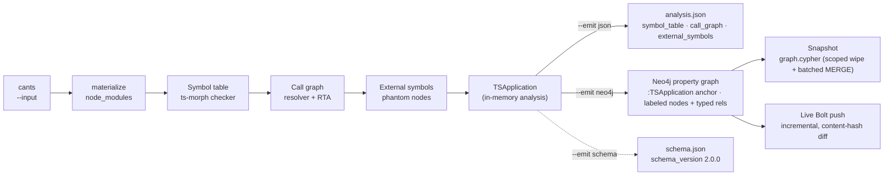

import Neo4jPropertyGraph from '../../components/Neo4jPropertyGraph.astro';
import { Steps, Aside, LinkCard, CardGrid, Tabs, TabItem } from "@astrojs/starlight/components";

**codeanalyzer-typescript** is a static-analysis tool for TypeScript and JavaScript source code. You point it at a project directory and it produces one typed artifact — a `TSApplication` — that captures the project's **symbol table** (modules, classes, interfaces, enums, type aliases, callables), its **call graph** (who-calls-whom), and the **external symbols** it reaches (phantom stubs for imported-library targets). You stop grepping source by hand and start querying a structured model of the program. The CLI ships as a self-contained binary named **`cants`**.

It is the TypeScript backend behind [CLDK](https://github.com/codellm-devkit/python-sdk), the multilingual analysis SDK — the same role [`codeanalyzer-python`](https://github.com/codellm-devkit/codeanalyzer-python) and [`codeanalyzer`](https://github.com/codellm-devkit/codeanalyzer-java) play for Python and Java. You can use it through CLDK's typed facade, or directly as a CLI that writes `analysis.json` — or projects the same analysis into a **Neo4j property graph**, a queryable, persistent system of record you populate once and read from everywhere.

<Neo4jPropertyGraph />

## The mental model

Every run follows the same shape: point at a project, build the artifact, consume the typed model — as JSON, or as a graph.

<Steps>

1. **Point at a project.** `cants --input ./my-project`. The tool discovers every `.ts`/`.tsx`/`.js` file (test trees excluded by default) and, by default, materializes the project's `node_modules` so the compiler can resolve imported types and call targets.

2. **It builds a `TSApplication`.** The TypeScript compiler — driven through [ts-morph](https://ts-morph.com/) — extracts the symbol table; the same checker resolves each call site into the call graph, with Rapid Type Analysis expanding virtual dispatch and phantom nodes capturing external calls.

3. **Choose an output target.** `--emit json` (the default) writes `analysis.json` or streams JSON to stdout. `--emit neo4j` projects the same in-memory analysis into a labeled property graph — either a self-contained `graph.cypher` snapshot or an incremental push to a live Neo4j over Bolt. `--emit schema` publishes the versioned graph schema contract.

</Steps>



## What you get back

The `--emit json` artifact is a single `TSApplication`. The live artifact has **three** top-level pieces:

| Field | Type | What it holds |
| --- | --- | --- |
| `symbol_table` | `Record<string, TSModule>` | One `TSModule` per source file — its imports, exports, classes, interfaces, enums, type aliases, functions, namespaces, and variables. |
| `call_graph` | `TSCallEdge[]` | Identity-keyed `source -> target` edges (by `TSCallable.signature`) with a `weight`, `provenance`, and `tags`. |
| `external_symbols` | `Record<string, TSExternalSymbol>` | Phantom stubs for call targets outside the project — imported libraries and Node builtins. |

<Aside type="note" title="entrypoints is reserved, not emitted">
`entrypoints` is part of the schema and is documented as a top-level key, but `core.ts` does not emit it — the live artifact carries only `symbol_table`, `call_graph`, and `external_symbols`. The graph mirrors this: a `:TSEntrypoint` marker label exists in the catalog, but entrypoint detection is level-2 roadmap.
</Aside>

<Aside type="note" title="Identity-keyed graph">
Call-graph nodes aren't a separate vertex type in `analysis.json` — they're the `TSCallable.signature` strings already in the symbol table (or an `external_symbols` key). Rich per-call metadata (receiver, arguments, location) lives on the `TSCallsite` entries inside each callable. See the [output schema](/codeanalyzer-typescript/reference/schema/).
</Aside>

## How identity works

A single canonicalizer, `signatureOf`, computes both caller- and callee-side identifiers, so a call graph `source`/`target` value **byte-matches** the corresponding `symbol_table` (or `external_symbols`) key. A signature is the project-relative file path (without extension) dot-joined with the member path — e.g. `src/user.UserService.getUser`. Constructors normalize to `<ClassSignature>.constructor`. See [Core concepts](/codeanalyzer-typescript/guides/concepts/#signatures-are-the-identity).

## From one JSON file to a property graph

`analysis.json` is one file per project, and that is its ceiling. To answer a question across a portfolio you have to load each artifact whole into memory and parse it — the documents don't compose, and a large monorepo's blob is a memory problem before it is an analysis problem.

`--emit neo4j` projects the **same** in-memory analysis into a labeled property graph instead. Many applications live in one Neo4j database, each anchored at its own `:TSApplication` node whose unique `name` is the `--app-name` you passed. Cross-service and whole-monorepo questions become a Cypher traversal across all of them, not a parse of giant JSON.

Everything is scoped by the application anchor. `--app-name` sets the `name` of the single `:TSApplication` node (a `MERGE` key enforced by a uniqueness constraint) and defaults to the input directory's basename. Every module hangs off that node via `TS_HAS_MODULE`; a re-load wipes only that app's prior subgraph before writing the new one, so apps never clobber each other. Shared `:TSExternal`, `:TSPackage`, and `:TSDecorator` nodes carry no `_module` property — they are `MERGE`-only and survive across apps, so externals, packages, and decorators are shared infrastructure rather than per-app duplicates.

<Aside type="caution" title="Prefer the NEO4J_PASSWORD env var">
A password passed as `--neo4j-password` is visible in your shell history and the process list. Set `NEO4J_PASSWORD` (and, if you like, `NEO4J_URI` / `NEO4J_USERNAME` / `NEO4J_DATABASE`) in the environment instead; the flag wins only when both are set.
</Aside>

### Snapshot or live, by one flag

`--emit neo4j` chooses between two mutually-exclusive writers based on whether `--neo4j-uri` is set:

<Tabs>
  <TabItem label="Snapshot (graph.cypher)">
```bash
# No --neo4j-uri => write a self-contained Cypher script to ./out/graph.cypher
cants --input ./my-ts-project \
  --emit neo4j \
  --app-name my-ts-app \
  --output ./out

# Load it into any Neo4j with cypher-shell
cypher-shell -u neo4j < ./out/graph.cypher
```

The snapshot is one portable file: DDL for constraints and indexes, a scoped `DETACH DELETE` of this app's prior subgraph, then batched `UNWIND … MERGE` for nodes and relationships. It is deliberately **not** incremental — a static script has no view of the live database.
  </TabItem>
  <TabItem label="Live Bolt push (incremental)">
```bash
# With --neo4j-uri => push incrementally over Bolt. Password comes from NEO4J_PASSWORD.
export NEO4J_PASSWORD=secret
cants --input ./my-ts-project \
  --emit neo4j \
  --app-name my-ts-app \
  --neo4j-uri bolt://localhost:7687 \
  --neo4j-user neo4j \
  --neo4j-database neo4j
```

The Bolt writer ensures constraints and indexes, then diffs each module's `content_hash` against the database and only re-pushes **changed** modules. On a full run, modules whose source file vanished are pruned; a targeted run (`--target-files`) skips pruning because it can't tell deleted files from untargeted ones.
  </TabItem>
</Tabs>

### A versioned schema contract

`--emit schema` writes `schema.json` — the machine-readable, version-stamped catalog of every node label, relationship type, and key property. It needs no `--input`, and the `schema_version` (currently `2.0.0`) is also stamped onto every `:TSApplication` node, so a consumer can detect a producer/consumer mismatch before it reads stale shapes.

```bash
cants --emit schema --output ./out   # writes ./out/schema.json
```

## Producer and consumer, at scale

The graph splits analysis into two roles that scale independently.

The **producer** is heavy and runs out-of-band — a CI step or a Kubernetes **Job / CronJob** that runs `cants --emit neo4j --neo4j-uri …` and pushes app-scoped subgraphs into one shared, managed or clustered Neo4j (Aura, Enterprise, or a cluster for HA). Many such jobs write into the same database, each scoped to its own `--app-name`.

The **consumers** are lightweight, read-only clients — agents, dashboards, code search, and the CLDK Python SDK. They hold only read credentials and a Bolt URI; they never run the analyzer, carry no JDK or native binary, and don't need the project source. Reads fan out from the cluster and scale separately from the analysis pods. A fulltext index (`code_fts` over callable code and docstrings) plus name indexes make code search a first-class query over the graph.

<Aside type="tip" title="Multi-tenant by construction">
Per-application scoped wipes, content-hash incrementality, a versioned schema contract, read-only RBAC, and shared externals/packages/decorators make the graph governed infrastructure your tools can depend on — not a throwaway export.
</Aside>

## Reading the graph from CLDK — no re-analysis

This is the enterprise payoff: analysis is produced once, centrally, then read cheaply everywhere. CLDK has a read-only Neo4j backend. Point `CLDK.typescript` at a `Neo4jConnectionConfig` and it reconstructs the **same** typed model objects (`TSClass`, `TSCallable`, …) and the **same** `networkx` call graph the in-process analyzer would build — with **no JDK, no `cants` binary, and no project source** on the consumer. It only needs the graph and read-only credentials.

```python
# TypeScript project — read-only Neo4j backend
from cldk import CLDK
from cldk.analysis.commons.backend_config import Neo4jConnectionConfig

analysis = CLDK.typescript(
    backend=Neo4jConnectionConfig(
        uri="bolt://localhost:7687",
        username="neo4j",
        password="neo4j",            # read-only credentials are sufficient
        application_name="my-ts-app", # MUST equal the --app-name the graph was loaded with
    ),
)

classes = analysis.get_classes()            # Dict[str, TSClass]
externals = analysis.get_external_symbols() # phantom library targets, for source->sink reachability
cg = analysis.get_call_graph()              # networkx.DiGraph
```

Install the driver extra with `pip install cldk[neo4j]` (or `pip install neo4j`). The `application_name` scopes every query to one `:TSApplication`, so it **must** match the `--app-name` the graph was loaded with. Because the graph is external, `project_path` is optional for this backend — the SDK polls a graph someone else produced.

You can also drop to raw Cypher for cross-application questions the typed facade doesn't model — for example, every external library symbol reached from a given app:

```cypher
MATCH (:TSApplication {name: "my-ts-app"})-[:TS_HAS_MODULE]->(:TSModule)
      -[:TS_DECLARES*0..]->(c:TSCallable)-[:TS_CALLS]->(x:TSExternal)
RETURN x.module AS package, x.name AS symbol, count(*) AS calls
ORDER BY calls DESC
```

## Two (or three) ways to use it

<Tabs>
  <TabItem label="CLI (JSON)">
```bash
# Write analysis.json to ./out
cants --input ./my-project --output ./out

# Or stream JSON to stdout (no --output)
cants --input ./my-project | jq '.call_graph | length'
```
  </TabItem>
  <TabItem label="CLI (Neo4j)">
```bash
export NEO4J_PASSWORD=secret
cants --input ./my-project \
  --emit neo4j \
  --app-name my-project \
  --neo4j-uri bolt://localhost:7687
```
  </TabItem>
  <TabItem label="Through CLDK (Neo4j)">
```python
from cldk import CLDK
from cldk.analysis.commons.backend_config import Neo4jConnectionConfig

analysis = CLDK.typescript(
    backend=Neo4jConnectionConfig(
        uri="bolt://localhost:7687",
        application_name="my-project",
    ),
)
print(analysis.get_call_graph())   # -> networkx.DiGraph
```
  </TabItem>
</Tabs>

<Aside type="note" title="Self-contained binary">
`cants` is a prebuilt binary that needs no Bun or Node at runtime. Install it via pip (`codeanalyzer-typescript` on PyPI), Homebrew (`codellm-devkit/homebrew-tap`), or the shell installer. CLDK locates it through `codeanalyzer_typescript.bin_path()` / `schema_path()`.
</Aside>

## Why a dedicated tool

A code LLM asked *"what calls this function?"* without analysis crawls: file read after file read, grep after grep, burning tokens on an answer it still can't be sure of. codeanalyzer-typescript resolves that once, statically, into a graph — so the answer is a lookup, not a guess. The TypeScript compiler gives you precise resolution for free on every run; RTA recovers the virtual-dispatch targets a naive resolver would miss; phantom nodes keep the calls into third-party libraries visible instead of silently dropped. With `--emit neo4j`, that resolution becomes a persistent, shared graph many tools query instead of each one re-deriving it.

## Where to go next

<CardGrid>
  <LinkCard title="Quickstart" description="Install cants and produce your first analysis.json." href="/codeanalyzer-typescript/quickstart/" />
  <LinkCard title="Core concepts" description="Symbol table, call graph, external symbols, signatures, provenance, caching." href="/codeanalyzer-typescript/guides/concepts/" />
  <LinkCard title="CLI usage" description="Every flag with worked examples, including --emit neo4j." href="/codeanalyzer-typescript/guides/cli-usage/" />
  <LinkCard title="Output schema" description="The TSApplication data model and the Neo4j property graph in full." href="/codeanalyzer-typescript/reference/schema/" />
</CardGrid>
