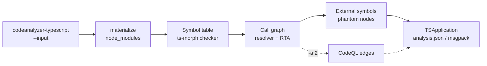

import { Steps, Aside, LinkCard, CardGrid, Tabs, TabItem } from "@astrojs/starlight/components";

**codeanalyzer-typescript** is a static-analysis tool for TypeScript and JavaScript source code. You point it at a project directory and it produces one typed artifact — a `TSApplication` — that captures the project's **symbol table** (modules, classes, interfaces, enums, type aliases, callables), its **call graph** (who-calls-whom), and the **external symbols** it reaches (phantom stubs for imported-library targets). You stop grepping source by hand and start querying a structured model of the program.

It is the TypeScript backend behind [CLDK](https://github.com/codellm-devkit/python-sdk), the multilingual analysis SDK — the same role [`codeanalyzer-python`](https://github.com/codellm-devkit/codeanalyzer-python) and [`codeanalyzer`](https://github.com/codellm-devkit/codeanalyzer-java) play for Python and Java. You can use it through CLDK's typed facade, or directly as a CLI that writes `analysis.json`.

## The mental model

Every run follows the same shape: point at a project, build the artifact, consume the typed model.

<Steps>

1. **Point at a project.** `codeanalyzer-typescript --input ./my-project`. The tool discovers every `.ts`/`.tsx`/`.js` file (test trees excluded by default) and, by default, materializes the project's `node_modules` so the compiler can resolve imported types and call targets.

2. **It builds a `TSApplication`.** The TypeScript compiler — driven through [ts-morph](https://ts-morph.com/) — extracts the symbol table; the same checker resolves each call site into the call graph, with Rapid Type Analysis expanding virtual dispatch and phantom nodes capturing external calls.

3. **Consume the typed model.** Get `analysis.json` (or msgpack) on disk, or pipe the JSON straight to `jq`. Everything is one typed document: `symbol_table`, `call_graph`, `external_symbols`, `entrypoints`.

</Steps>



## What you get back

The artifact is a single `TSApplication` with four top-level pieces:

| Field | Type | What it holds |
| --- | --- | --- |
| `symbol_table` | `Record<string, TSModule>` | One `TSModule` per source file — its imports, exports, classes, interfaces, enums, type aliases, functions, namespaces, and variables. |
| `call_graph` | `TSCallEdge[]` | Identity-keyed `source -> target` edges (by `TSCallable.signature`) with a `weight`, `provenance`, and `tags`. |
| `external_symbols` | `Record<string, TSExternalSymbol>` | Phantom stubs for call targets outside the project — imported libraries and Node builtins. |
| `entrypoints` | `Record<string, TSEntrypoint[]>` | Framework-dispatched roots, keyed by framework name. Empty at level 1. |

<Aside type="note" title="Identity-keyed graph">
Call-graph nodes aren't a separate vertex type — they're the `TSCallable.signature` strings already in the symbol table (or an `external_symbols` key). Rich per-call metadata (receiver, arguments, location) lives on the `TSCallsite` entries inside each callable. See the [output schema](/codeanalyzer-typescript/reference/schema/).
</Aside>

## How identity works

A single canonicalizer, `signatureOf`, computes both caller- and callee-side identifiers, so a call graph `source`/`target` value **byte-matches** the corresponding `symbol_table` (or `external_symbols`) key. A signature is the project-relative file path (without extension) dot-joined with the member path — e.g. `src/user.UserService.getUser`. Constructors normalize to `<ClassSignature>.constructor`. See [Core concepts](/codeanalyzer-typescript/guides/concepts/#signatures-are-the-identity).

## Two ways to use it

<Tabs>
  <TabItem label="CLI">
```bash
# Write analysis.json to ./out
codeanalyzer-typescript --input ./my-project --output ./out

# Or stream JSON to stdout (no --output)
codeanalyzer-typescript --input ./my-project | jq '.call_graph | length'
```
  </TabItem>
  <TabItem label="From source">
```bash
# Run the analyzer directly with Bun, no compile step
bun run start -- --input ./my-project --output ./out
```
  </TabItem>
  <TabItem label="Through CLDK">
```python
from cldk import CLDK
from cldk.analysis import AnalysisLevel

analysis = CLDK(language="typescript").analysis(
    project_path="my-project",
    analysis_level=AnalysisLevel.call_graph,
)
print(analysis.get_call_graph())      # -> networkx.DiGraph
```
  </TabItem>
</Tabs>

## Why a dedicated tool

A code LLM asked *"what calls this function?"* without analysis crawls: file read after file read, grep after grep, burning tokens on an answer it still can't be sure of. codeanalyzer-typescript resolves that once, statically, into a graph — so the answer is a lookup, not a guess. The TypeScript compiler gives you precise resolution for free on every run; RTA recovers the virtual-dispatch targets a naive resolver would miss; phantom nodes keep the calls into third-party libraries visible instead of silently dropped.

## Where to go next

<CardGrid>
  <LinkCard title="Quickstart" description="Build the CLI and produce your first analysis.json." href="/codeanalyzer-typescript/quickstart/" />
  <LinkCard title="Core concepts" description="Symbol table, call graph, external symbols, signatures, provenance, caching." href="/codeanalyzer-typescript/guides/concepts/" />
  <LinkCard title="CLI usage" description="Every flag with worked examples." href="/codeanalyzer-typescript/guides/cli-usage/" />
  <LinkCard title="Output schema" description="The TSApplication data model in full." href="/codeanalyzer-typescript/reference/schema/" />
</CardGrid>
